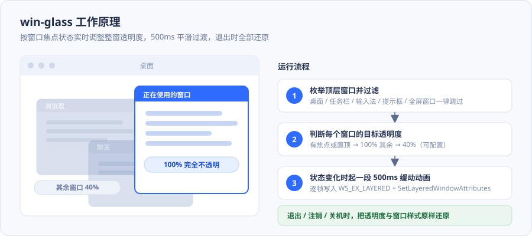

# win-glass · Windows 轻量桌面窗口美化工具--让你的壁纸随时可见(≧∇≦)ﾉ

> **让当前正在用的窗口保持清晰，其余窗口自动变半透明。**
> 纯 Python 标准库实现（`ctypes`），不依赖 pywin32，无后台服务，退出即还原。

你有没有过这种体验：屏幕上开了十几个窗口，想看清当前在用的那个，却总被后面的窗口干扰？

**win-glass** 就是解决这个问题的：它常驻在系统托盘，实时盯着窗口焦点——

| 窗口状态 | 透明度 |
| --- | --- |
| **正在使用的窗口**（有焦点） | **100%** 完全不透明(可调) |
| **置顶窗口**（Always on Top） | **100%** 完全不透明(可调) |
| 其他所有窗口 | **40%** 半透明(可调)） |

焦点一换，透明度在 **500ms(可调) 内平滑过渡**，不会生硬地跳变。



---

## 目录

- [下载安装](#下载安装)
- [快速上手](#快速上手)
- [系统托盘怎么用](#系统托盘怎么用)
- [命令行参数](#命令行参数)
- [它是怎么做到的](#它是怎么做到的)
- [常见问题](#常见问题)
- [已知限制](#已知限制)
- [从源码构建](#从源码构建)
- [项目结构](#项目结构)
- [许可](#许可)

---

## 下载安装

从 [**Releases 页面**](../../releases/latest) 下载 `win_glass_setup_v1.5.0.exe`，双击即可。

| 项目 | 说明 |
| --- | --- |
| 系统要求 | Windows 10 / 11（64 位） |
| 需要 Python 吗 | **不需要**，安装包里已包含运行时 |
| 需要管理员权限吗 | **不需要**，不弹 UAC |
| 安装位置 | `%LOCALAPPDATA%\Programs\win_glass`（用户目录） |
| 卸载 | 控制面板「程序和功能」→ win_glass；或直接运行安装目录里的 `uninstall.exe` |

安装完成后，在开始菜单搜索 **win_glass** 打开。

> **安装包本身是命令行程序**，双击后会有一个黑窗口显示安装进度，这是正常的；
> 装完之后日常使用的 `win_glass.exe` **完全没有任何窗口**，只会在右下角托盘出现一个图标。

---

## 快速上手

1. 双击 `win_glass_setup_v1.5.0.exe` 完成安装
2. 开始菜单搜索 `win_glass` 启动
3. 右下角系统托盘出现图标 → **它已经在工作了**
4. 随手指点几个窗口，你会看到：你正在用的那个是清晰的，其他都变淡了

想让它开机自动运行？用管理员以外的普通身份执行：

```bat
win_glass_setup_v1.5.0.exe --autostart
```

取消开机自启：`win_glass_setup_v1.5.0.exe --no-autostart`

---

## 系统托盘怎么用

日常只需要用托盘图标，不用记命令：

| 操作 | 效果 |
| --- | --- |
| **左键单击** | 暂停 / 继续（暂停时**所有窗口立刻恢复 100%**） |
| **右键** | 弹出菜单：暂停、立即恢复、悬停开关、全屏开关、**三个滑块**、**渐隐时间**、打开日志、退出 |

托盘图标**不会出现在任务栏，也不会出现在 Alt+Tab 里**，不占地方。

> 退出时（无论点「退出」、注销还是关机）程序都会把**所有窗口的透明度和样式原样还原**。
> 万一遇到异常导致没还原，重新运行一次再正常退出即可。

### 右键菜单里的三个滑块

在菜单里直接调透明度与悬停系数，不用记命令、也不用重启：

```
┌──────────────────────────────────┐
│ 暂停（所有窗口恢复 100%）            │
│ 立即把所有窗口恢复 100%              │
│ 悬停半透明（未聚焦窗口 → 88%）        │
│ 全屏窗口固定 100%                   │
├──────────────────────────────────┤
│ 非聚焦最低透明度           40%   │  ← 拖动 / 滚轮 / ←→ 微调
│ ●━━━━━━━━━━━━━━━○──────────── │  ← 圆形手柄，悬停变大
│ 聚焦最高透明度            100%   │
│ ●━━━━━━━━━━━━━━━━━━━━━━━━━━○ │
│ 悬停插值系数               0.8   │  ← 0.0 ~ 1.0，步进 0.1
│ ●━━━━━━━━━━━━━━━━━━━━━○───── │
├──────────────────────────────────┤
│ 渐隐时间…                 500 ms │  ← 点开输入毫秒数
├──────────────────────────────────┤
│ 打开日志                          │
│ 退出（还原全部窗口）                │
└──────────────────────────────────┘
```

| 滑块 | 作用 | 范围 | 步进 | 默认 |
| --- | --- | --- | --- | --- |
| **非聚焦最低透明度** | 没在用的窗口淡化到多少 | **5% ~ 95%** | 1% | 40% |
| **聚焦最高透明度** | 你正在用的窗口清晰到多少 | **5% ~ 100%** | 1% | 100% |
| **悬停插值系数** | 鼠标压住的未聚焦窗口提亮到哪一档 | **0.0 ~ 1.0** | 0.1 | 0.8 |

- **悬停插值系数**（v1.5.0）：悬停值 = `最低 + (最高 − 最低) × 系数`。
  系数 `0.0` = 等于最低值（视觉上等于没开悬停），`0.5` = 正好取中间，`1.0` = 等于最高值。
  默认 `0.8` —— 偏向"更接近清晰"那一侧，鼠标压过去的窗口会明显提亮。
  拖动它，**上面那行「悬停半透明（未聚焦窗口 → xx%）」会实时跟着变**，所见即所得。
- **外观与交互对齐 Windows 任务栏音量条**：细轨道 + 圆形手柄，已填充部分一直连到手柄
- **手柄会跟着你的操作放大一圈**：悬停、按住拖动、方向键微调时都有明确反馈
- 颜色跟随**系统强调色**（浅色/深色主题各自适配；选中行单独一套配色）
- 两个透明度滑块**步进恒为 1%**、数值恒为**整数**；悬停系数滑块步进 **0.1**、显示**一位小数**
- 三种调法：**按住拖动**、**鼠标滚轮**（±1 档）、**左右方向键**（±1 档，想精确到某个值时最方便）
- **拖动时数值和进度条实时跟手**，菜单**不会关**，松手后接着点别的项或点外面关闭
- **改完自动记住**：写入 `%LOCALAPPDATA%\win_glass\config.json`，下次开机照旧

### 右键菜单里的「渐隐时间…」

点开是一个小输入框，直接填**毫秒数**：

| 项 | 说明 |
| --- | --- |
| 范围 | **1 ~ 5000 ms**，默认 `500` |
| 生效时机 | **立即生效** —— 正在跑的过渡会按新时长重排时间轴，不用等下一次切换 |
| 越界 / 乱填 | 越界自动夹紧到合法范围；填非数字退回原值；点「取消」或直接关窗则不做任何改动 |
| 持久化 | 写入 `config.json` 的 `fade_ms`，下次启动沿用 |

想调数值时数值框里的内容默认**全选**，直接敲新数字即可；`Enter` = 确定，`Esc` = 取消。

> 注意：滑块的改动会**立刻**作用到桌面窗口上——这是设计如此，所见即所得。
> 如果不希望留下记录，用 `--no-config` 启动，改动就只在本次运行有效。

---

## 命令行参数

窗口化版本没有控制台，所以想看输出请用随包安装的 **`win_glass-console.exe`**（同一份程序，带控制台）。
位置：`%LOCALAPPDATA%\Programs\win_glass\win_glass-console.exe`

| 参数 | 默认值 | 说明 |
| --- | --- | --- |
| `--inactive-alpha <0.05~0.95>` | `0.40` | 未聚焦窗口的透明度（也接受 `5~95` 这种整数百分比写法） |
| `--active-alpha <0.05~1.0>` | `1.00` | 聚焦 / 最大化 / 置顶窗口的透明度（也接受 `5~100`）。**全屏窗口不受它影响，恒为 100%** |
| `--no-config` | 关 | **既不读也不写**配置文件，滑块改动只在本次运行有效 |
| `--save-config` | 关 | 把本次命令行参数**写入配置文件**后继续运行 |
| `--fade-ms <毫秒>` | 配置文件里的值，默认 `500` | 渐变时长，**1 ~ 5000**；设 `1` 近似立刻生效（无动画感）。不给就用配置文件里存的 |
| `--fps <帧率>` | `60` | 动画帧率 |
| `--scan <秒>` | `0.15` | 焦点变化检测间隔 |
| `--rescan <秒>` | `0.50` | 窗口列表全量重扫间隔 |
| `--exclude <类名,...>` | 空 | **额外**排除的窗口类名，逗号分隔 |
| `--skip-fullscreen` | 关 | 全屏窗口**完全不接管**（原样保留，给全屏游戏留退路）。默认是接管并锁 100% |
| `--no-skip-fullscreen` | — | **已废弃**，保留为无操作参数以兼容旧脚本；请改用 `--skip-fullscreen` |
| `--skip-foreign-layered` | 关 | 跳过那些**自己已经在用**分层透明度的窗口（如 Electron 应用） |
| `--no-restore` | 关 | 退出时**不**还原透明度（一般不要用） |
| `--no-tray` | 关 | 不创建托盘图标（纯命令行运行） |
| `--log <路径>` | `%LOCALAPPDATA%\win_glass\win_glass.log` | 日志文件位置 |
| `--duration <秒>` | `0`（常驻） | 跑指定秒数后自动退出并还原 |
| `-v`, `--verbose` | 关 | 每次状态变化都打印 |
| `--list` | — | **只列出**当前窗口及各自的目标透明度，不做任何修改 |
| `--self-test` | — | 用自带的测试窗口验证透明度链路是否正常 |
| `--version` | — | 打印版本号 |
| `-h`, `--help` | — | 帮助 |

常用示例：

```bat
:: 想让背景更淡一点
win_glass-console.exe --inactive-alpha 0.25

:: 想让过渡更快
win_glass-console.exe --fade-ms 200

:: 想先看看它会接管哪些窗口，再决定要不要排除
win_glass-console.exe --list

:: 排除某个软件的窗口
win_glass-console.exe --exclude MyAppClass,AnotherClass

:: 跑 30 秒自动退出，用来快速试效果
win_glass-console.exe --duration 30

:: 临时试一下、不留记录（滑块改动也只在本次运行生效）
win_glass-console.exe --no-config --inactive-alpha 0.25

:: 把这次的设置固化成默认值
win_glass-console.exe --save-config --inactive-alpha 0.25 --active-alpha 1.0
```

---

## 它是怎么做到的

用一句话概括：**给窗口加上 `WS_EX_LAYERED` 扩展样式，再用 `SetLayeredWindowAttributes` 设置整窗 alpha**。

```
① 用 EnumWindows 枚举所有顶层窗口
② 过滤掉不该动的（桌面、任务栏、输入法、提示框…）
③ 按优先级链判定状态，算出目标透明度（见下表）
④ 状态变了就起一段 500ms 缓动动画，逐帧写入 alpha
⑤ 退出时把 alpha 与扩展样式还原
```

### 谁算「正在使用」：判定优先级链

```
全屏（恒 100%，不受「聚焦最高透明度」影响）
  └─ 聚焦（前台窗口）           → 聚焦最高透明度
      └─ 最大化 IsZoomed()      → 聚焦最高透明度
          └─ 置顶 TOPMOST       → 聚焦最高透明度
              └─ 悬停（鼠标压住） → 最低 + (最高 − 最低) × 滑块的系数
                  └─ 未聚焦      → 非聚焦最低透明度
```

几点说明：

- **全屏恒 100%**：看电影、玩游戏时不该被压暗。这里用的是**独立常量**，
  就算你把「聚焦最高透明度」调到 60%，全屏窗口也仍然是 100%。
- **最大化 / 置顶也算"聚焦"**：它们占满屏幕或压在所有窗口之上，视觉主导权等价于焦点窗口，
  所以跟随「聚焦最高透明度」。**你把最高值调到 80%，最大化窗口就跟着变 80%。**
- **最大化 ≠ 全屏**，这是两个独立状态。判定上做了两件事来保证它们不串：
  1. `IsZoomed()` **一票否决** —— 用户按了最大化的窗口，无论矩形长什么样都不算全屏；
  2. 矩形覆盖判定留 2px 内缩容差（不同 DPI 缩放会让真全屏窗口差一两像素）。
  为什么必须这么写：Windows 最大化时会**故意把窗口矩形撑到屏幕外面**（那圈看不见的缩放边框），
  实测 `(-8,-8,1928,1088)` 对 `(0,0,1920,1080)` —— 只按"矩形是否盖住屏幕"判，
  **所有最大化窗口都会被误判成全屏**并锁死 100%。取证脚本 `fs_probe.py` 会把这几行矩形摊开对比。
- **悬停只提亮、绝不压暗**：参与者只有「本应被压暗的未聚焦窗口」。
  全屏 / 聚焦 / 最大化 / 置顶当前都是最高透明度，按同一个系数算只会把它们压暗，所以一律不参与。
- **全屏窗口不额外加分层位**：本来不透明的全屏窗口要设 100%，正确做法是**什么都不做**——
  一旦给它加上 `WS_EX_LAYERED`，DWM 的独立翻转/硬件叠加优化会被关掉，全屏视频可能掉帧。

技术上有几个容易踩的坑，这个项目都处理了：

| 坑 | 后果 | 处理方式 |
| --- | --- | --- |
| 64 位下窗口句柄被截断 | `SetWindowLong` 失效甚至崩溃 | 统一用 `GetWindowLongPtrW` / `SetWindowLongPtrW`，32 位才回退 |
| `SetLayeredWindowAttributes` 的 alpha 参数被截断 | 255 变成 -1，效果错乱 | 该参数实际是 `BYTE`，ctypes 里按 `DWORD` 声明并由低位取值 |
| 加了扩展样式却不生效 | 窗口毫无变化 | 首次挂 `WS_EX_LAYERED` 后补一次 `SetWindowPos(SWP_FRAMECHANGED)`；**只在首次**，每帧都调会闪 |
| Electron / Chromium 应用自己已在用分层 | 覆盖了它的透明度、退出还原不回去 | 接管前先 `GetLayeredWindowAttributes()` 记录原值，退出时原样还原；也可用 `--skip-foreign-layered` 直接跳过 |
| 改坏了窗口（黑屏、无法交互） | 影响正常使用 | 设置失败就标记为 `failed` 并**从此不再重试**，绝不反复折腾同一个窗口 |
| 误伤桌面 / 任务栏 / 输入法 | 系统界面变半透明 | 内置排除清单（见下） |
| 把 `WM_MEASUREITEM` 与 `WM_DRAWITEM` 的值记反 | 消息照样收得到，但拿到的是**另一个结构体**：宽高写进了绘制结构体的 `itemAction/itemState`，绘制时读到的 `rcItem` 又是测量结构体里的垃圾值 → **菜单项尺寸怎么设都不生效、整项一片空白** | 两个常量写在一起并加注释固定下来（`WM_DRAWITEM=0x2B` / `WM_MEASUREITEM=0x2C`），自检脚本 `probe_map.py` 可直接打出「消息号 ↔ 结构体形状」对照 |
| 把 `MSGF_MENU` 回调里的 `msg.hwnd` 当成菜单窗口 | 该 `hwnd` **不保证是菜单窗口**（可能是 shell 的 `SystemUserAdapterWindowClass`），拿它去重绘会**静默失败**：不报错、不返回失败，菜单永远不重绘 → 「拖着滑块数值不刷新，指针移出才刷新」 | 只接受窗口类为 `#32768` 的句柄，并用 `FindWindowW` / `WindowFromPoint` 逐级校验；回归测试 `menu_live_test.py` 用 `BitBlt` 抓像素差异来抓这个 bug |

### 右键菜单里的滑块是怎么塞进去的

Win32 的弹出菜单**没有滑块控件**，`TrackPopupMenu` 期间菜单会跑自己的一套模态消息循环，
普通子窗口控件（`msctls_trackbar32`）放不进去。所以这两个滑块是「自绘 + 消息钩子」拼出来的：

| 环节 | 用到的接口 | 作用 |
| --- | --- | --- |
| 建项 | `InsertMenuItemW` + `MFT_OWNERDRAW` | 菜单里留出一块由程序自己画的位置 |
| 定尺寸 | `WM_MEASUREITEM` | 告诉系统这一项要 300×46（两行：标题 + 数值 / 轨道 + 手柄） |
| 画出来 | `WM_DRAWITEM` | 用系统给的 `hDC` + `rcItem` 自己画：圆头胶囊做轨道，`Ellipse` 画圆形手柄 |
| 拖动 | `SetWindowsHookExW(WH_MSGFILTER)` | 钩住**菜单模态循环内部**的鼠标消息，才能做到「拖着菜单不关」 |
| 跟手重绘 | `RedrawWindow(..., RDW_INVALIDATE \| RDW_UPDATENOW)` | 值一变就只重画这一项，不重开菜单 |

几个关键点：

- 拖动时必须**吞掉**鼠标按下/抬起消息（改写 `msg.message = WM_NULL` 并 `return 1`），否则点一下菜单就关了；
  但 **`WM_MOUSEMOVE` 故意不吞**——菜单靠它高亮光标下的项，吞了方向键微调也就永远不生效
- 滚轮增量在 **`lParam` 的高 16 位**（`wParam` 装的是光标坐标）；读错字段会表现为「滚轮乱跳或完全不动」
- **重绘必须打在菜单窗口上（窗口类 `#32768`）**。`MSGF_MENU` 回调里的 `msg.hwnd` **不保证是菜单窗口**，
  第一眼看到的可能是 shell 的 `SystemUserAdapterWindowClass`；把它当成菜单窗口缓存下来，重绘就全打在无关窗口上，
  **不报错但永远不重绘**，症状是「鼠标停在滑块上拖动时数值和进度条不刷新，指针一移出去才刷新」。
  修法：只接受 `#32768`，并用 `FindWindowW` / `WindowFromPoint` 逐级校验回填（见下）
- `RedrawWindow(RDW_UPDATENOW)` 比 `InvalidateRect` + `UpdateWindow` 更可靠：菜单窗口的 `WM_PAINT` 有自己的节奏，
  `RDW_UPDATENOW` 会**立刻同步**画一遍
- 手柄行程两端各**内缩 9px**（`SLIDER_THUMB_INSET`）：不内缩的话滑到 0% / 100% 时圆形手柄会被菜单项边缘切掉
- 绘制（百分比 → 圆心）与命中判定（x → 百分比）**共用同一组坐标函数**，否则会出现「点在这里、手柄停在那里」
- 系统会在请求宽度上再加一段菜单留白，所以实测菜单项比请求值宽一点，高度是精确的
- 百分比在内存与配置里**都是整数**，不是「先存小数再四舍五入显示」——这样 1% 步进是结构性保证，不可能出现小数点

**内置排除的窗口类**（不会动它们）：

```
Progman, WorkerW, Shell_TrayWnd, Shell_SecondaryTrayWnd, SysShadow,
ForegroundStaging, MultitaskingViewFrame, XamlExplorerHostIslandWindow,
Windows.UI.Core.CoreWindow, Windows.Internal.Shell.TabProxyWindow,
ApplicationFrameWindow, TaskListThumbnailWnd, DV2ControlHost,
tooltips_class32, MsgIMEWindowClass, Default IME, IME,
NarratorHelperWindow, Windows.UI.Composition.DesktopWindowContentBridge
```

另外，**全屏窗口默认接管并锁在 100%**——你在看电影或玩游戏时不会被干扰。
如果某些全屏程序不喜欢被接管（少数独占全屏的游戏、播放器），用 `--skip-fullscreen`
让它们完全不参与，程序会原样保留它们的透明度与扩展样式。

---

## 常见问题

**Q：装上后没反应？**
A：先确认右下角托盘区有图标（可能被折叠进「隐藏的图标」里了）。再运行 `win_glass-console.exe --list` 看它是否识别到了窗口。日志在 `%LOCALAPPDATA%\win_glass\win_glass.log`。

**Q：某个软件的窗口没变透明？**
A：多半是它在内置排除清单里，或者它是全屏窗口，或者它自己已经在用分层透明度。用 `--list` 可以确认；如果是 Electron 应用（VS Code、Discord 等），它们自带透明度处理，跳过是**有意为之**，避免互相打架。

**Q：任务栏 / 桌面变透明了？**
A：不应该发生（它们在排除清单里）。如果遇到请提 issue，附上 `--list` 的输出。

**Q：会影响性能吗？**
A：不会明显影响。它只做两件事：低频枚举窗口 + 动画期间按帧写一个属性。项目自带的长跑测试会采样内存与 CPU。

**Q：右键菜单里的滑块，调完的值会自己记住吗？**
A：会。**非聚焦最低透明度**、**聚焦最高透明度**、**悬停插值系数**、**渐隐时间**、
以及两个勾选开关（**悬停半透明** / **全屏窗口固定 100%**）都存在
`%LOCALAPPDATA%\win_glass\config.json`（分别是 `inactive_percent` / `active_percent` /
`hover_ratio` / `fade_ms` / `hover_enabled` / `fullscreen_lock`），下次启动自动生效。
想临时试一下不落盘，用 `--no-config` 启动。

**Q：滑块为什么不能拖一点点？我想要 41.5%。**
A：**两个透明度滑块是故意的**：步进固定 1%、取值恒为整数——这也是本项目的设计目标之一。想要更精细的过渡，调**渐隐时间**比调百分比更有效。
不过 **v1.5.0 的「悬停插值系数」滑块是 0.1 步进**，因为它本身就是一个 0~1 的小数系数，需要一位小数精度。

**Q：滑块拖不动 / 菜单一拖就关？**
A：如果你在用**第三方外壳增强工具**（StartAllBack、ExplorerPatcher、Windhawk、Winstep 等），它们会挂钩菜单代码，可能干扰自绘菜单项。先在干净的 Windows 上试一次，能定位是不是这个原因；日志与 `--list` 的输出对排查也有帮助。

**Q：滑块上的数值和进度条不跟着手走，松开鼠标才更新？**
A：这是 v1.2.0 修掉的一个 bug（根因：菜单重绘打在了 shell 的无关辅助窗口上，静默失败）。请确认你装的是 **v1.2.0 或更新**版本：托盘右键 → 打开日志，启动那行会写明版本号。

**Q：渐隐时间填了没反应 / 填 0 会怎样？**
A：合法范围是 **1 ~ 5000 ms**，越界会自动夹紧（填 `0` 等于 `1`，也就是几乎瞬间生效）。改完**立即生效**，正在跑的过渡会按新时长重排。填非数字会退回原值，点「取消」不做任何改动。

**Q：怎么彻底卸载？**
A：控制面板「程序和功能」里卸载，或运行安装目录下的 `uninstall.exe`。卸载前它会**先礼貌地请程序退出**，让所有窗口恢复正常，再删除文件与注册表项。

**Q：为什么不支持 macOS / Linux？**
A：核心依赖的是 Windows 的 `WS_EX_LAYERED` 机制，其他系统没有对应实现。macOS 上类似效果需要辅助功能 API 且权限门槛高，暂不考虑。

---

## 已知限制

- 只支持 **Windows x64**（Windows 10 / 11）
- 某些**独占全屏**或**硬件加速自绘**的程序（部分游戏、播放器）不吃 `WS_EX_LAYERED`，属系统限制
- 如果 Windows 的**桌面窗口管理器（DWM）被关闭**，效果可能异常
- 内置排除清单是经验值，遇到特殊软件用 `--exclude` 补充
- 装到用户目录（不需要管理员），因此**只对当前用户生效**；多用户环境需各自安装

---

## 从源码构建

需要 Python 3.10+ 和 PyInstaller 6.x。

```bat
:: 1) 直接运行（需要 PySide 以外的库都可用；本程序只用标准库）
python win_glass.py --list

:: 2) 打包出 exe 与安装包（产物在 dist\ ）
pip install pyinstaller
python build.py
```

`build.py` 会用**当前正在运行它的解释器**来调用 PyInstaller，所以你不需要改任何路径。
要指定别的解释器，设置环境变量 `WIN_GLASS_PY` 即可。

产物：

| 文件 | 说明 |
| --- | --- |
| `dist\win_glass.exe` | 主程序：无控制台窗口 + 系统托盘 |
| `dist\win_glass-console.exe` | 同样的程序，带控制台，用于 `--list` / `-v` 等诊断 |
| `dist\win_glass_setup_v1.5.0.exe` | 安装包（内含上面两个 + 图标 + 卸载器） |

### 自检与测试

```bat
:: 用自带测试窗口验证透明度链路
python win_glass.py --self-test

:: 滑块：取值 / 坐标映射 / 真画一遍并用 GetPixel 反查填充边界与手柄形状 /
::       持久化 / 滚轮与点击的字段解析 / 数值输入框端到端 / 菜单项逐项核对
python slider_test.py

:: 实时重绘回归：指针停在菜单项上拖动时，数值文字与进度条是否真的在重画
::（BitBlt 抓像素差异判定；把 _redraw_item 换成空函数即可复现旧 bug）
python menu_live_test.py

:: 托盘菜单滑块实机验证：真弹菜单、合成鼠标拖动、截图、断言菜单项尺寸与落盘值
python menu_e2e_test.py

:: 端到端：真实切换窗口焦点，断言透明度在 100% 与 40% 之间正确变化
python e2e_test.py

:: 健壮性：参数边界 / 零窗口 / 30 秒长跑内存与 CPU / 强杀还原 / 托盘 / 优雅退出
python robustness_test.py

:: 安装包：沙盒里完整走 安装 → 校验 → 卸载 → 清理
python install_test.py

:: 排查自绘菜单用的诊断脚本：打印「消息号 ↔ 结构体形状」对照
python probe_map.py

:: 把滑块 7 种状态离屏渲染成 PNG，用眼睛确认观感（不弹菜单、不动桌面窗口）
python probe_slider_render.py
```

测试脚本都用「正在运行它的解释器」和「脚本自身所在目录」，clone 下来直接就能跑。

> `menu_live_test.py` / `menu_e2e_test.py` 会在你的桌面上**真的弹出一次托盘菜单**
> 并用**合成鼠标**操作它（结束时会点菜单外部关闭，全程不动任何真实窗口的透明度）。
> `probe_map.py` 同样会短暂弹一次菜单。
>
> 这几个会动鼠标的测试**建议一个一个单独跑**：连着跑的时候偶发「菜单还没弹出来就断言」
> 的假失败（脚本已改为轮询等待菜单窗口，但合成鼠标本身仍受桌面状态影响）。
>
> Pillow 是**可选**的：测试的断言本身只用纯 `ctypes`（`GetPixel` / `BitBlt`），
> 装不装都能跑；装了才会额外把证据截图存到 `test_out/`。
> `probe_slider_render.py` 要存 PNG，所以那个脚本需要 Pillow（`pip install pillow`）。

---

## 项目结构

```
win-glass/
├── win_glass.py           主程序（窗口枚举、透明度引擎、托盘、托盘菜单滑块、CLI）
├── installer.py           安装器 / 卸载器（打包成 setup exe）
├── build.py               一键打包脚本
├── make_icon.py           生成 icon.ico
├── victim_window.py       测试用的「靶子窗口」
├── slider_test.py         滑块单元测试（取值 / 映射 / 绘制 / 持久化 / 输入解析 / 数值输入框 / 菜单内容 / 悬停系数 / 最大化≠全屏）
├── menu_live_test.py      实时重绘回归：拖住滑块时数值与进度条是否真在重画
├── menu_e2e_test.py       托盘菜单滑块实机验证
├── e2e_test.py            端到端测试
├── robustness_test.py     健壮性 / 可用性测试
├── install_test.py        安装包沙盒测试
├── hover_live_test.py     悬停判定在真实桌面 + 真实光标上的验证（零副作用）
├── fs_probe.py            最大化 / 全屏判定取证：摊开 IsZoomed + 窗口矩形 + rcMonitor + rcWork
├── fs_e2e.py              让打包好的 exe 去给真实窗口分类（端到端判定取证）
├── check_verinfo.py       读 exe 里嵌的版本资源，核对三处版本号有没有漏改
├── probe_map.py           自绘菜单诊断：消息号 ↔ 结构体形状
├── probe_slider_render.py 离屏渲染滑块各状态成 PNG，肉眼确认观感
├── icon.ico               图标
├── docs/
│   ├── win_glass_v1.0.1_fix_report.md     v1.0.1 修复报告（含问题根因分析）
│   ├── win_glass_v1.1.0_slider_report.md  v1.1.0 滑块实现与排障记录
│   ├── win_glass_v1.2.0_slider_report.md  v1.2.0 音量条样式与「拖动不重绘」根因
│   ├── win_glass_v1.3.0_hover_report.md   v1.3.0 悬停半透明（轮询 / 只提亮不压暗）
│   ├── win_glass_v1.4.0_focus_rules_report.md  v1.4.0 最大化/置顶视作聚焦、全屏恒 100%
│   └── win_glass_v1.4.1_maximized_not_fullscreen_fix.md  v1.4.1 修复「最大化被误判成全屏」
├── assets/
│   └── how-it-works.svg   原理示意图
├── tools/out/             发布产物的 SHA256 校验值
└── RELEASE_NOTES.md / CHANGELOG.md
```

---

## 许可

**本项目未附开源许可证（All rights reserved）。**

这意味着代码虽然公开可见，但默认**不授予**复制、修改、再分发或商用的权利。
如果你希望以某种开源许可证发布（例如 MIT / Apache-2.0），或想授权他人使用，
请通过 issue 联系作者。

---

<sub>作者：Naiqey.千鵺 <1609458331@qq.com></sub>
