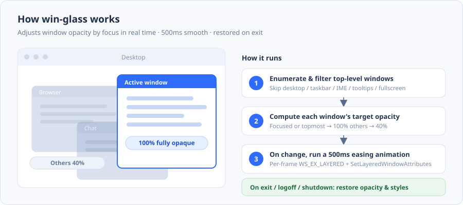

<a id="top"></a>

> **📑 目录 · Contents** — 点击快速跳转 / click to jump

| 语言 Language | 版本 Version |
| --- | --- |
| [**English ⬇**](#english) | 英文版（置顶 / pinned on top） |
| [**简体中文 ⬇**](#chinese) | 中文版 |

**English** · [Download & Install](#download--install) · [Quick Start](#quick-start) · [Using the System Tray](#using-the-system-tray) · [Cascade decay](#cascade-decay-by-window-stacking-order) · [Command-line Arguments](#command-line-arguments) · [How It Works](#how-it-works) · [FAQ](#faq) · [Known Limitations](#known-limitations) · [Build from Source](#build-from-source) · [Project Structure](#project-structure) · [License](#license)

**中文版** · [下载安装](#下载安装) · [快速上手](#快速上手) · [系统托盘怎么用](#系统托盘怎么用) · [层叠衰减](#层叠衰减按窗口堆叠顺序逐层递减) · [命令行参数](#命令行参数) · [它是怎么做到的](#它是怎么做到的) · [常见问题](#常见问题) · [已知限制](#已知限制) · [从源码构建](#从源码构建) · [项目结构](#项目结构) · [许可](#许可)

[↑ 回到顶部 / back to top](#top)

---

<a id="english"></a>

# win-glass · Windows lightweight desktop window beautifier — keep your wallpaper always visible (≧∇≦)ﾉ

> **Keep the window you're actively using crystal clear; let every other window fade to translucency automatically.**
> Pure Python standard library (`ctypes`), no pywin32 dependency, no background service — fully restored on exit.

Ever had this: a dozen windows open, and the one you're actually using keeps getting lost behind the others?

**win-glass** solves exactly that. It lives in the system tray and watches window focus in real time —

| Window state | Opacity |
| --- | --- |
| **Fullscreen window** (game / video / presentation) | **100%** fixed, unaffected by any setting |
| **The window you're using** (has focus) | **90%** fully opaque (adjustable) |
| **Maximized / topmost window** (Always on Top) | **90%** treated as focused (adjustable) |
| 1st unfocused layer | **50%** translucent (adjustable) |
| 2nd layer and below | **previous layer × 70% (adjustable)**, cascading down, floor 5% |

When focus changes, opacity transitions smoothly within **500ms (adjustable)** — no hard jumps. When the stacking order changes, every layer's target is **recomputed across the whole chain** (see [Cascade decay](#cascade-decay-by-window-stacking-order)).



---

## Table of Contents

- [Download & Install](#download--install)
- [Quick Start](#quick-start)
- [Using the System Tray](#using-the-system-tray)
- [Cascade decay (by window stacking order)](#cascade-decay-by-window-stacking-order)
- [Command-line Arguments](#command-line-arguments)
- [How It Works](#how-it-works)
- [FAQ](#faq)
- [Known Limitations](#known-limitations)
- [Build from Source](#build-from-source)
- [Project Structure](#project-structure)
- [License](#license)

---

## Download & Install

Download `win_glass_setup_v1.7.1.exe` from the [**Releases page**](../../releases/latest) and double-click.

| Item | Notes |
| --- | --- |
| Requirements | Windows 10 / 11 (64-bit) |
| Need Python? | **No** — the runtime is bundled in the installer |
| Need admin? | **No** — no UAC prompt |
| Install location | `%LOCALAPPDATA%\Programs\win_glass` (user dir) |
| Uninstall | Control Panel » Programs and Features » win_glass; or run `uninstall.exe` in the install dir |

After install, search **win_glass** in the Start menu to launch.

> The installer itself is a command-line program; double-clicking shows a black window with progress — that's normal. Once installed, the daily `win_glass.exe` has **no window at all** — just a tray icon in the bottom-right.

---

## Quick Start

1. Double-click `win_glass_setup_v1.7.1.exe` to install
2. Search `win_glass` in the Start menu to launch
3. A tray icon appears bottom-right → **it's already working**
4. Click around a few windows: the one you're using stays clear, the rest fade

Want it to start at login? Run as a normal (non-admin) user:

```bat
win_glass_setup_v1.7.1.exe --autostart
```

Disable autostart: `win_glass_setup_v1.7.1.exe --no-autostart`

---

## Using the System Tray

Daily use only needs the tray icon — no commands to memorize:

| Action | Effect |
| --- | --- |
| **Left click** | Pause / resume (when paused, **all windows snap back to 100%**) |
| **Right click** | Pop menu: pause, hover toggle, fullscreen toggle, cascade decay, **four sliders**, **fade time**, **language**, open log, quit |
| **Right-click a menu item** | Enter **shortcut recording**: press a key or combo to bind & auto-save; right-click empty area / Esc cancels |

The tray icon **doesn't appear in the taskbar or Alt+Tab** — it stays out of the way.

> On exit (whether you click Quit, log off, or shut down) the program restores **every window's opacity and style exactly as before**. If something crashed and it didn't restore, just run it once more and quit normally.

### The four sliders in the right-click menu

Adjust opacity, hover factor and cascade decay right in the menu — no commands, no restart:

```
┌──────────────────────────────────┐
│ Pause (all windows → 100%)        │
│ Hover translucency (bg → 88%)     │
│ Fullscreen locked to 100%         │
│ Cascade decay (L1~L4 40/28/20/14%)│  ← click to toggle
├──────────────────────────────────┤
│ Min opacity (unfocused)    40%    │  ← drag / wheel / ←→
│ ●━━━━━━━━━━━━━━━○────────────    │
│ Max opacity (focused)      100%   │
│ ●━━━━━━━━━━━━━━━━━━━━━━━━━━○     │
│ Hover blend factor           0.8  │  ← 0.0~1.0 step 0.1
│ ●━━━━━━━━━━━━━━━━━━━━━━━○─────   │
│ Layer decay factor           0.7  │  ← 0.1~1.0 step 0.1
│ ●━━━━━━━━━━━━━○──────────────    │
├──────────────────────────────────┤
│ Fade time…                 500 ms │  ← type milliseconds
├──────────────────────────────────┤
│ Language (13)                     │  ← applies instantly
├──────────────────────────────────┤
│ Open log                          │
│ Quit (restore all windows)        │
└──────────────────────────────────┘
```

| Slider | What it does | Range | Step | Default |
| --- | --- | --- | --- | --- |
| **Min opacity (unfocused)** | How faint the topmost unfocused window gets | **5% ~ 95%** | 1% | 40% |
| **Max opacity (focused)** | How clear the window you're using gets | **5% ~ 100%** | 1% | 100% |
| **Hover blend factor** | How bright the unfocused window under the cursor gets | **0.0 ~ 1.0** | 0.1 | 0.8 |
| **Layer decay factor** | What each deeper layer is multiplied by | **0.1 ~ 1.0** | 0.1 | 0.7 |

- **Hover blend factor** (v1.5.0): hover value = `min + (max − min) × factor`. Factor `0.0` = equals the min (visually same as hover off); `0.5` = right in the middle; `1.0` = equals the max. Default `0.8` leans toward "clearer" — the window under the cursor brightens noticeably. Drag it and **the "Hover translucency (→ xx%)" line above updates live** — what you see is what you get.
- ⭐ **Hover linkage dimming** (v1.7.1): while you hover a window, **every other rule-affected window** (focused / maximized / topmost / unfocused alike) dims at the same time to `base × ratio`, where `ratio = hover factor − 0.3` (floor `0.1`), and the resulting value never drops below **5%**. Example: factor `0.7` → ratio `0.4` → a 100% window goes to 40%. Fullscreen stays 100%; the hovered window itself only brightens, never dims.
- **Layer decay factor** (v1.6.0): see [Cascade decay](#cascade-decay-by-window-stacking-order) below. There's also a "Cascade decay (L1~L4 …)" item you can **click to toggle the whole thing**; off means "all unfocused windows use the min opacity".
- **Looks & feels like the Windows taskbar volume slider**: thin track + round thumb, filled portion runs all the way to the thumb.
- **The thumb grows a ring on interaction**: hover, drag-hold, and arrow-key nudges all give clear feedback.
- Color follows the **system accent color** (light/dark themes each adapt; the selected row has its own palette).
- The two opacity sliders always step **1%** and always show **integers**; the hover and layer-decay sliders step **0.1** and show **one decimal**.
- Three ways to adjust: **drag**, **mouse wheel** (±1 step), **left/right arrow keys** (±1 step, best when you want an exact value).
- **The value and bar track your hand live**; the menu **stays open**; after release you can click another item or click outside to close.
- **Auto-saved when changed**: written to `%LOCALAPPDATA%\win_glass\config.json`, persists across reboots.

---

### Tray menu enhancements (v1.7.0): right-click to bind shortcuts / multilingual / Win11 rounded corners

#### 1. Bind a global shortcut to a menu item (right-click to record)

Pause, hover toggle, fullscreen toggle, cascade decay, **fade time**, open log, quit — all of these can bind a global shortcut, so a single keypress in any window triggers it, **no need to click the tray**.

| Action | Effect |
| --- | --- |
| **Right-click a menu item** | Enter recording: the item's second line becomes "Press a shortcut" |
| **Press a key or combo and release** | Bind immediately and **auto-save** to config |
| **Right-click empty menu area / Esc** | Cancel this recording |
| **Press Delete / Backspace alone while recording** | Unbind the item (same as "not bound") |

Conflicting and invalid keys are **gently rejected** — no crash, no binding a key that won't fire:

- Binding a **modifier by itself / Esc / a mouse button** → "invalid key"
- The combo is **already taken by another item** → "conflicts with xx", marked in accent color on that item
- The combo is **taken by the system or another app** (real RegisterHotKey failure) → "registration failed", not written to config

State is fully persisted: shortcuts and language live in `config.json`, restored on reboot.

#### 2. Show the current shortcut after each item

Under the toggle label is a **gray sub-line**: if bound, it shows the combo (e.g. `Ctrl+Alt+P`, with a "right-click to unbind" hint); if not, it shows "right-click to set shortcut" to guide you. One-off hints like conflict/failure are drawn in **accent color** so they're obvious at a glance.

#### 3. Switch UI language anytime

A **"Language" submenu** appears at the bottom of the menu, with **13 built in**: `auto` (follow system UI language), 简体中文, 繁體中文, English, 日本語, 한국어, Deutsch, Français, Русский, العربية, Português, Español, Italiano. Selection applies instantly and persists; all menu/dialog text follows.

#### 4. Auto-adapt Windows 11 rounded corners

The tray menu's border and selection highlight render with Windows 11's rounded-corner style (via `DwmSetWindowAttribute` setting the corner preference on the menu window); on Windows 10 and earlier it degrades gracefully to square corners — **zero cost, harmless**.

---

### Hover linkage dimming (v1.7.1)

While the cursor hovers a managed window, that window brightens to its hover value and **every other rule-affected window dims together**, so the window under your cursor stands out:

| Item | Rule |
| --- | --- |
| Hovered window | `min + (max − min) × hover factor` (brighten only) |
| Every other window (focused / maximized / topmost / unfocused) | `base × ratio`, where `ratio = hover factor − 0.3`, floored at `0.1` |
| Absolute floor | **5%** — no dimmed window ever goes below it |
| Fullscreen | **exempt** — always 100% |
| The hovered window itself | **never dimmed** |

Example: hover factor `0.7` ⇒ `ratio = 0.4` ⇒ a 100% window goes to 40%, a 40% window to 16% (the deep end floor is 5%). Turn hover off and everything returns to its normal target — no residue.

---

### Cascade decay (by window stacking order)

**The problem it solves**: with only "focused / unfocused" two tiers, if you have 5 windows open and 4 are unfocused, they're all the same opacity (say 40%) — **no hierarchy between them**, you can't tell which is on top of which, it all blurs together.

**The approach**: number all **ordinary unfocused windows** by Windows' **Z-order** (top to bottom); layer 1 uses "min opacity", each layer after multiplies by "layer decay factor":

```
input
  base   = min opacity (slider, default 40%)
  ratio  = layer decay factor (slider, default 0.70)
  floor  = floor 5% (a constant in code)
  layer# = which position this window holds among all "ordinary unfocused windows" (1-based)

output (opacity, integer percent)
  layer 1 = base
  layer n = round( layer n−1's already-displayed integer × ratio ), but not below floor
```

With defaults `base = 40%`, `ratio = 0.70`:

| Layer | Calculation | Result |
| --- | --- | --- |
| Layer 1 | start | **40%** |
| Layer 2 | 40 × 0.7 = 28 | **28%** |
| Layer 3 | 28 × 0.7 = 19.6 → 20 | **20%** |
| Layer 4 | 20 × 0.7 = 14 | **14%** |
| Layer 5 | 14 × 0.7 = 9.8 → 10 | **10%** |
| Layer 6 | 10 × 0.7 = 7 | **7%** |
| Layer 7 and below | 7 × 0.7 = 4.9 → but floor 5 | **5%** |

Switching to "focused 90% / unfocused 50%" (drag the unfocused slider to 50%), the four windows become **focused 90% / layer1 50% / layer2 35% / layer3 25%**.

Three things worth stressing:

1. **It recurses on "the previous layer's already-rounded displayed value", not `base × ratio^(n−1)`.** So when you see 28% on screen you can mentally compute the next layer is 19.6→20% — **every layer is verifiable by eye**. The cost is rounding error accumulates down the layers — a **deliberate** trade-off: internal consistency beats "absolutely precise but doesn't match the screen".
2. **Rounding is true round-half-up**, not the language-default "banker's rounding". Python's built-in `round(24.5)` gives `24`, but here it must be `25`; so `round_half_up()` is implemented by hand.
3. **Which windows get numbered? Only "ordinary unfocused windows".** Fullscreen / focused / maximized / topmost **don't take a layer number** and don't participate in decay (they have their own higher priority). Especially **topmost windows**: physically they sit very high; if they took a number, everything below would be pushed down a layer while they themselves don't decay — the layering would be unexplainable.

**How layers update on change?** The engine recomputes every round (default **0.15s**) in three passes:

```
Pass 1  judge each window's state (fullscreen / focused / maximized / topmost),
        collecting the "ordinary unfocused windows" set
Pass 2  read the Z-order chain once (GetTopWindow → GW_HWNDNEXT),
        number the Pass-1 set by Z-order → {window: layer}
Pass 3  compute each window's target by its "layer number", hand off to easing
```

Three passes (not one) are required because **a window computed earlier doesn't know how many ordinary unfocused windows sit below it**. All three passes are **read-only** — they write no alpha; only the animation frame writes opacity to the screen. So switching windows, minimizing, or creating a window changes the Z-order, and the next round (≤0.15s) **recomputes the whole chain** and eases to the new values.

Two ways to turn it off: click the "Cascade decay" item in the menu, or `--no-layer-decay` on the command line. Off means all unfocused windows uniformly use "min opacity" (the v1.5.0-and-before behavior).

### The "Fade time…" item in the right-click menu

Click to open a small input box and type **milliseconds**:

| Item | Notes |
| --- | --- |
| Range | **1 ~ 5000 ms**, default `500` |
| When it takes effect | **Immediately** — the running transition reschedules to the new duration, no need to wait for the next switch |
| Out of range / garbage | Out-of-range auto-clamps to legal range; non-numeric reverts to original; "Cancel" or closing the window makes no change |
| Persistence | Written to `config.json`'s `fade_ms`, used on next launch |

The input box selects all by default — just type the new number; `Enter` = confirm, `Esc` = cancel.

> Note: slider changes apply to desktop windows **immediately** — by design, what you see is what you get. If you don't want it recorded, launch with `--no-config` and changes only last for this run.

---

## Command-line Arguments

The windowed build has no console, so to see output use the bundled **`win_glass-console.exe`** (same program, with console). Location: `%LOCALAPPDATA%\Programs\win_glass\win_glass-console.exe`

| Argument | Default | Notes |
| --- | --- | --- |
| `--inactive-alpha <0.05~0.95>` | `0.40` | Opacity of unfocused windows (also accepts integer percent like `5~95`) |
| `--active-alpha <0.05~1.0>` | `1.00` | Opacity of focused / maximized / topmost windows (also accepts `5~100`). **Fullscreen is unaffected, always 100%** |
| `--no-layer-decay` | off | **Disable cascade decay**: all unfocused windows uniformly use "min opacity" (v1.5.0-and-before behavior) |
| `--layer-decay-ratio <0.1~1.0>` | `0.70` | Layer decay factor: each deeper ordinary unfocused layer multiplies by it (multiplying the **previous layer's rounded displayed value**), floor 5% |
| `--no-config` | off | **Neither read nor write** config; slider changes only last this run |
| `--save-config` | off | **Write this run's CLI args to config** then keep running |
| `--fade-ms <ms>` | config value, default `500` | Transition duration, **1 ~ 5000**; `1` ≈ instant (no animation). Omit to use stored config |
| `--fps <rate>` | `60` | Animation frame rate |
| `--scan <sec>` | `0.15` | Focus-change detection interval |
| `--rescan <sec>` | `0.50` | Full window-list rescan interval |
| `--exclude <class,..>` | empty | **Extra** window classes to exclude, comma-separated |
| `--skip-fullscreen` | off | **Fully ignore** fullscreen windows (leave as-is, an escape hatch for fullscreen games). Default is to take over and lock 100% |
| `--no-skip-fullscreen` | — | **Deprecated**, kept as a no-op for old-script compatibility; use `--skip-fullscreen` |
| `--skip-foreign-layered` | off | Skip windows that **already use** layered translucency themselves (e.g. Electron apps) |
| `--no-restore` | off | **Don't** restore opacity on exit (generally don't use) |
| `--no-tray` | off | Don't create a tray icon (pure CLI) |
| `--log <path>` | `%LOCALAPPDATA%\win_glass\win_glass.log` | Log file location |
| `--duration <sec>` | `0` (resident) | Auto-exit and restore after N seconds |
| `-v`, `--verbose` | off | Print on every state change |
| `--list` | — | **Only list** current windows and their target opacities, make no changes |
| `--self-test` | — | Verify the opacity chain with the built-in test window |
| `--version` | — | Print version |
| `-h`, `--help` | — | Help |

Common examples:

```bat
:: make the background a bit fainter
win_glass-console.exe --inactive-alpha 0.25

:: make transitions faster
win_glass-console.exe --fade-ms 200

:: see which windows it would take over, before deciding exclusions
win_glass-console.exe --list

:: exclude some app's windows
win_glass-console.exe --exclude MyAppClass,AnotherClass

:: run 30s then auto-exit, quick try
win_glass-console.exe --duration 30

:: try temporarily, no record (slider changes only last this run)
win_glass-console.exe --no-config --inactive-alpha 0.25

:: no layering, all unfocused windows equally faint
win_glass-console.exe --no-layer-decay --inactive-alpha 0.4

:: spread the layers more (each layer drops more)
win_glass-console.exe --layer-decay-ratio 0.5

:: bake this run's settings as defaults
win_glass-console.exe --save-config --inactive-alpha 0.25 --active-alpha 1.0
```

---

## How It Works

In one sentence: **add the `WS_EX_LAYERED` extended style to a window, then use `SetLayeredWindowAttributes` to set whole-window alpha**.

```
① EnumWindows to enumerate all top-level windows
② Filter out ones that shouldn't move (desktop, taskbar, IME, tooltips…)
③ Judge state by the priority chain, compute target opacity (see table below)
④ On state change, start a 500ms easing animation, write alpha per frame
⑤ On exit, restore alpha and the extended style
```

### Who counts as "in use": the priority chain

```
Fullscreen (fixed 100%, unaffected by "max opacity")
  └─ Focused (foreground window)        → max opacity
      └─ Maximized IsZoomed()           → max opacity
          └─ Topmost TOPMOST            → max opacity
              └─ Hover (cursor on it)   → min + (max − min) × slider factor
                  └─ Ordinary unfocused → cascade decay: layer 1 = min,
                                        each layer after = prev layer's rounded value × decay (floor 5%)
```

Notes:

- **Fullscreen fixed 100%**: movies and games shouldn't be dimmed. This uses an **independent constant** — even if you set "max opacity" to 60%, fullscreen stays 100%.
- **Maximized / topmost also count as "focused"**: they fill the screen or sit above everything, visually dominating like the focus window, so they follow "max opacity". **Set the max to 80% and the maximized window follows to 80%.**
- **Cascade decay only affects ordinary unfocused windows**: fullscreen / focused / maximized / topmost **don't take a layer number**. This is mandatory — a topmost window is physically high; if it took a number, everything below would be pushed down a layer while it itself doesn't decay, and the layering becomes unexplainable. In other words: **"treated as focused" windows are neither dimmed by decay nor affect others' layer numbers.**
- **Maximized ≠ fullscreen** — two independent states. Two things guarantee they don't cross: 1. `IsZoomed()` is a **veto** — a window the user maximized is never fullscreen regardless of its rectangle; 2. the rectangle-cover test leaves a 2px inward slack (different DPI scaling makes a true fullscreen off by a pixel or two). Why this must be written so: Windows **deliberately pushes a maximized window's rectangle past the screen edges** (that invisible resize border); measured `(-8,-8,1928,1088)` vs `(0,0,1920,1080)` — judging only "does the rectangle cover the screen", **every maximized window would be misjudged as fullscreen and locked to 100%**. The `fs_probe.py` forensic script lays these rectangles out side by side.
- **Hover does two things** (v1.7.1): ① the hovered window itself only ever *brightens* — and only if it's one that "should have been dimmed" (fullscreen / focused / maximized / topmost are already at max, so applying the interpolation would only dim them, hence they don't take part in that); ② meanwhile **all other rule-affected windows dim together** to `base × (hover factor − 0.3)`, with the ratio floored at `0.1` and the resulting value floored at `5%`. Fullscreen is exempt from both. Net effect: a focus spotlight — the window under your cursor stands out while everything else recedes.
- **Fullscreen windows get no extra layered bit**: a本来-opaque fullscreen window set to 100% should do **nothing** — once you add `WS_EX_LAYERED`, DWM's independent flip / hardware overlay optimization is turned off and fullscreen video may drop frames.

A few easy-to-trip pitfalls, all handled by this project:

| Pitfall | Consequence | Handling |
| --- | --- | --- |
| 64-bit window handle truncated | `SetWindowLong` fails or crashes | Uniformly use `GetWindowLongPtrW` / `SetWindowLongPtrW`, fall back only on 32-bit |
| `SetLayeredWindowAttributes` alpha truncated | 255 becomes -1, broken effect | The param is actually a `BYTE`; declared as `DWORD` in ctypes and read from low bits |
| Added style but no effect | Window unchanged | After first `WS_EX_LAYERED`, add `SetWindowPos(SWP_FRAMECHANGED)`; **first time only** — calling every frame flickers |
| Electron / Chromium app already uses layering | Overwrites its opacity, can't restore on exit | Before taking over, `GetLayeredWindowAttributes()` records the original; restored on exit; or `--skip-foreign-layered` to skip entirely |
| Broke a window (black screen, uninteractive) | Affects normal use | On failure mark `failed` and **never retry that window** — never thrash the same window |
| Hit desktop / taskbar / IME by mistake | System UI turns translucent | Built-in exclusion list (below) |
| Swapped `WM_MEASUREITEM` / `WM_DRAWITEM` values | Messages still arrive, but you get **another struct**: width/height written into the draw struct's `itemAction/itemState`, and the `rcItem` you read at draw time is garbage from the measure struct → **menu item size never takes effect, the whole item is blank** | The two constants are written together with a comment pinning them (`WM_DRAWITEM=0x2B` / `WM_MEASUREITEM=0x2C`); the `probe_map.py` self-check prints the "message# ↔ struct shape" map directly |
| Took the `msg.hwnd` in the `MSGF_MENU` callback as the menu window | That `hwnd` **isn't guaranteed to be the menu window** (could be the shell's `SystemUserAdapterWindowClass`); redrawing with it **silently fails**: no error, no failure return, the menu never repaints → "drag the slider and the value doesn't refresh until the pointer leaves" | Only accept a handle whose window class is `#32768`, and verify step-by-step with `FindWindowW` / `WindowFromPoint`; the `menu_live_test.py` regression test uses `BitBlt` pixel diffs to catch this bug |

### How the sliders get into the right-click menu

Win32 popup menus **have no slider control**, and during `TrackPopupMenu` the menu runs its own modal message loop, so ordinary child controls (`msctls_trackbar32`) can't be inserted. So these four sliders are built from "owner-draw + message hook":

| Step | API used | Role |
| --- | --- | --- |
| Build item | `InsertMenuItemW` + `MFT_OWNERDRAW` | Reserve a spot in the menu the program draws itself |
| Size it | `WM_MEASUREITEM` | Tell the system this item is 300×46 (two lines: title + value / track + thumb) |
| Draw it | `WM_DRAWITEM` | Using the system's `hDC` + `rcItem`, draw yourself: rounded-capsule track, `Ellipse` thumb |
| Drag | `SetWindowsHookExW(WH_MSGFILTER)` | Hook mouse messages **inside the menu's modal loop** so "drag without closing the menu" works |
| Live repaint | `RedrawWindow(..., RDW_INVALIDATE \| RDW_UPDATENOW)` | On value change, repaint only this item, don't reopen the menu |

Key points:

- During drag you must **swallow** mouse-down/up messages (set `msg.message = WM_NULL` and `return 1`), or a click closes the menu; but **`WM_MOUSEMOVE` is deliberately not swallowed** — the menu uses it to highlight the item under the cursor, and swallowing it would also kill arrow-key nudges.
- The wheel delta is in the **high 16 bits of `lParam`** (`wParam` holds cursor coords); reading the wrong field shows as "wheel jumps or doesn't move at all".
- **Repaint must hit the menu window (class `#32768`)**. The `msg.hwnd` in `MSGF_MENU` **isn't guaranteed to be the menu window** — the first thing you see may be the shell's `SystemUserAdapterWindowClass`; caching it as the menu window sends all repaints to an unrelated window, **no error but never repaints**, symptom: "drag the slider, value and bar don't refresh until the pointer leaves". Fix: only accept `#32768`, and verify step-by-step with `FindWindowW` / `WindowFromPoint` (below).
- `RedrawWindow(RDW_UPDATENOW)` is more reliable than `InvalidateRect` + `UpdateWindow`: the menu window's `WM_PAINT` has its own rhythm, and `RDW_UPDATENOW` paints **synchronously right now**.
- The thumb travel is **inset 9px** at both ends (`SLIDER_THUMB_INSET`): without it, at 0% / 100% the round thumb gets clipped by the item edge.
- Drawing (percent → center) and hit-testing (x → percent) **share the same coordinate function**, or you get "click here, thumb stops there".
- The system adds some menu padding to the requested width, so the item is a bit wider than requested; height is exact.
- Percentages in memory and config are **always integers**, not "store a decimal then round for display" — so 1% stepping is structurally guaranteed, no decimal points possible.

**Built-in excluded window classes** (won't be touched):

```
Progman, WorkerW, Shell_TrayWnd, Shell_SecondaryTrayWnd, SysShadow,
ForegroundStaging, MultitaskingViewFrame, XamlExplorerHostIslandWindow,
Windows.UI.Core.CoreWindow, Windows.Internal.Shell.TabProxyWindow,
ApplicationFrameWindow, TaskListThumbnailWnd, DV2ControlHost,
tooltips_class32, MsgIMEWindowClass, Default IME, IME,
NarratorHelperWindow, Windows.UI.Composition.DesktopWindowContentBridge
```

Also, **fullscreen windows are taken over and locked to 100% by default** — you won't be disturbed while watching a movie or playing a game. If some fullscreen program dislikes being taken over (a few exclusive-fullscreen games/players), use `--skip-fullscreen` to leave them entirely out; the program preserves their opacity and extended style as-is.

---

## FAQ

**Q: Installed but nothing happens?**
A: First confirm there's an icon in the bottom-right tray (it may be folded into "hidden icons"). Then run `win_glass-console.exe --list` to see if it recognizes your windows. Logs are at `%LOCALAPPDATA%\win_glass\win_glass.log`.

**Q: Some app's window didn't turn translucent?**
A: Probably it's in the built-in exclusion list, or it's a fullscreen window, or it already uses layered translucency itself. Use `--list` to confirm; if it's an Electron app (VS Code, Discord, etc.), they handle their own translucency — skipping them is **intentional** to avoid fighting each other.

**Q: Taskbar / desktop turned translucent?**
A: Shouldn't happen (they're in the exclusion list). If you see it, please file an issue with your `--list` output.

**Q: Does it affect performance?**
A: Not noticeably. It only does two things: low-frequency window enumeration + per-frame property writes during animation. The project's long-run test samples memory and CPU.

**Q: Do slider values persist after adjusting?**
A: Yes. **Min opacity**, **Max opacity**, **Hover blend factor**, **Fade time**, and the two toggles (**Hover translucency** / **Fullscreen locked 100%**) are all stored in `%LOCALAPPDATA%\win_glass\config.json` (as `inactive_percent` / `active_percent` / `hover_ratio` / `fade_ms` / `hover_enabled` / `fullscreen_lock`), applied automatically on next launch. To try without persisting, launch with `--no-config`.

**Q: Why can't the slider move a tiny bit? I want 41.5%.**
A: **The two opacity sliders are deliberate**: step is fixed at 1%, values are always integers — also one of this project's design goals. For a finer transition, tune **fade time** rather than percent. But **v1.5.0's "Hover blend factor" slider steps 0.1**, since it's itself a 0~1 decimal factor needing one-decimal precision.

**Q: Slider won't drag / menu closes as soon as I drag?**
A: If you're using a **third-party shell enhancer** (StartAllBack, ExplorerPatcher, Windhawk, Winstep, etc.), they hook the menu code and may interfere with owner-drawn items. Try once on a clean Windows to locate the cause; logs and `--list` output also help.

**Q: Slider value and bar don't follow my hand, only update after release?**
A: This was a bug fixed in v1.2.0 (root cause: menu repaint hit the shell's unrelated helper window, silently failing). Make sure you're on **v1.2.0 or later**: right-click tray → Open log, the launch line shows the version.

**Q: Fade time typed but no effect / what if I type 0?**
A: Legal range is **1 ~ 5000 ms**; out-of-range auto-clamps (typing `0` = `1`, i.e. near-instant). Change takes effect **immediately**, the running transition reschedules to the new duration. Non-numeric reverts to original; "Cancel" makes no change.

**Q: How to fully uninstall?**
A: Uninstall from Control Panel » Programs and Features, or run `uninstall.exe` in the install dir. Before uninstalling it **politely asks the program to exit** first, restoring all windows, then removes files and registry entries.

**Q: Why no macOS / Linux support?**
A: The core relies on Windows' `WS_EX_LAYERED` mechanism, which other systems don't have an equivalent for. A similar effect on macOS would need the Accessibility API with high permission barriers — not planned for now.

---

## Known Limitations

- **Windows x64 only** (Windows 10 / 11)
- Some **exclusive-fullscreen** or **hardware-accelerated self-drawn** programs (some games, players) don't take `WS_EX_LAYERED` — a system limitation
- If Windows' **Desktop Window Manager (DWM)** is off, the effect may misbehave
- The built-in exclusion list is empirical; for special apps use `--exclude`
- Installed to the user dir (no admin needed), so **only affects the current user**; multi-user environments need separate installs

---

## Build from Source

Requires Python 3.10+ and PyInstaller 6.x.

```bat
:: 1) Run directly (everything but PySide is available; this program uses only the stdlib)
python win_glass.py --list

:: 2) Package the exe and installer (output in dist\)
pip install pyinstaller
python build.py
```

`build.py` calls PyInstaller with **the interpreter currently running it**, so you don't need to change any paths. To point at another interpreter, set the `WIN_GLASS_PY` environment variable.

Output:

| File | Notes |
| --- | --- |
| `dist\win_glass.exe` | Main program: no console window + system tray |
| `dist\win_glass-console.exe` | Same program, with console, for `--list` / `-v` diagnostics |
| `dist\win_glass_setup_v1.7.1.exe` | Installer (bundles the above two + icon + uninstaller) |

### Self-check & tests

```bat
:: verify the opacity chain with the built-in test window
python win_glass.py --self-test

:: sliders: value / coord mapping / real draw + GetPixel reverse-check of fill edges & thumb shape /
::           persistence / wheel & click field parsing / numeric input box end-to-end / item-by-item menu check /
::           cascade decay (recursion / round-half-up / 5% floor / Z-order numbering / fullscreen-max-topmost don't take numbers)
python slider_test.py

:: hover translucency + priority chain: real desktop + real cursor, writes no alpha
:: (assert write-call count is 0; on real windows verify fullscreen>focused>maximized>topmost>hover>cascade)
python hover_live_test.py

:: live repaint regression: while dragging on a menu item, do the value text and bar actually repaint
:: (BitBlt pixel-diff; swap _redraw_item for a no-op to reproduce the old bug)
python menu_live_test.py

:: tray menu slider on-device verify: really pop the menu, synthesize mouse drag, screenshot, assert item size & persisted value
python menu_e2e_test.py

:: end-to-end: really switch window focus, assert opacity changes correctly between 100% and 40%
python e2e_test.py

:: robustness: param bounds / zero windows / 30s long-run memory & CPU / force-kill restore / tray / graceful exit
python robustness_test.py

:: installer: full walk in sandbox  install → verify → uninstall → cleanup
python install_test.py

:: diagnostic script for owner-drawn menus: print "message# ↔ struct shape" map
python probe_map.py

:: render the slider's 7 states offscreen to PNG, confirm look by eye (no menu pop, no desktop window touched)
python probe_slider_render.py
```

Test scripts use "the interpreter running them" and "their own directory", so clone-and-run works.

> `menu_live_test.py` / `menu_e2e_test.py` will **really pop the tray menu once** on your desktop and operate it with **synthesized mouse** (they click outside the menu to close at the end, touching no real window's opacity). `probe_map.py` also briefly pops a menu once.
>
> These mouse-moving tests are **best run one at a time**: running them back-to-back occasionally causes a false "menu not popped yet" assertion failure (the scripts now poll for the menu window, but synthesized mouse is still affected by desktop state).
>
> Pillow is **optional**: the test assertions themselves use only pure `ctypes` (`GetPixel` / `BitBlt`), and run with or without it; with it installed they additionally save evidence screenshots to `test_out/`. `probe_slider_render.py` needs Pillow to save PNG (`pip install pillow`).

---

## Project Structure

```
win-glass/
├── win_glass.py           main program (window enumeration, opacity engine, tray, tray-menu sliders, CLI)
├── installer.py           installer / uninstaller (packaged as setup exe)
├── build.py               one-click packaging script
├── make_icon.py           generate icon.ico
├── victim_window.py       "victim window" for testing
├── slider_test.py         slider unit tests (value / mapping / draw / persistence / input parse / numeric box / menu content / hover factor / maximized≠fullscreen)
├── menu_live_test.py      live repaint regression: does the value & bar actually repaint while dragging
├── menu_e2e_test.py       tray menu slider on-device verify
├── e2e_test.py            end-to-end test
├── robustness_test.py     robustness / usability test
├── install_test.py        installer sandbox test
├── hover_live_test.py     hover judgment on real desktop + real cursor (zero side effects)
├── fs_probe.py            maximized / fullscreen judgment forensics: lay out IsZoomed + window rect + rcMonitor + rcWork
├── fs_e2e.py              have the packaged exe classify real windows (end-to-end judgment forensics)
├── check_verinfo.py       read the version resource embedded in the exe, check the three version spots for misses
├── probe_map.py           owner-drawn menu diagnostic: message# ↔ struct shape
├── probe_slider_render.py offscreen-render the slider's states to PNG, confirm look by eye
├── icon.ico               icon
├── docs/
│   ├── win_glass_v1.0.1_fix_report.md     v1.0.1 fix report (with root-cause analysis)
│   ├── win_glass_v1.1.0_slider_report.md  v1.1.0 slider implementation & troubleshooting
│   ├── win_glass_v1.2.0_slider_report.md  v1.2.0 volume-slider style & "drag doesn't repaint" root cause
│   ├── win_glass_v1.3.0_hover_report.md   v1.3.0 hover translucency (polling / brighten-only-never-dim)
│   ├── win_glass_v1.4.0_focus_rules_report.md  v1.4.0 maximized/topmost treated as focused, fullscreen fixed 100%
│   └── win_glass_v1.4.1_maximized_not_fullscreen_fix.md  v1.4.1 fix "maximized misjudged as fullscreen"
├── assets/
│   └── how-it-works.svg   principle diagram
│   └── how-it-works.en.svg  principle diagram (English)
├── tools/out/             SHA256 checksums of release artifacts
└── RELEASE_NOTES.md / CHANGELOG.md
```

---

## License

**This project ships with no open-source license (All rights reserved).**

This means the code is publicly visible, but by default grants **no** rights to copy, modify, redistribute, or use commercially. If you'd like to release it under an open-source license (e.g. MIT / Apache-2.0), or want to authorize others to use it, please contact the author via an issue.

---

<sub>Author: Naiqey.千鵺 <1609458331@qq.com></sub>

---

<a id="chinese"></a>

# win-glass · Windows 轻量桌面窗口美化工具--让你的壁纸随时可见(≧∇≦)ﾉ

> **让当前正在用的窗口保持清晰，其余窗口自动变半透明。**
> 纯 Python 标准库实现（`ctypes`），不依赖 pywin32，无后台服务，退出即还原。

你有没有过这种体验：屏幕上开了十几个窗口，想看清当前在用的那个，却总被后面的窗口干扰？

**win-glass** 就是解决这个问题的：它常驻在系统托盘，实时盯着窗口焦点——

| 窗口状态 | 透明度 |
| --- | --- |
| **全屏窗口**（游戏 / 视频 / 演示） | **100%** 恒定，不受任何设置影响 |
| **正在使用的窗口**（有焦点） | **90%** 完全不透明(可调) |
| **最大化 / 置顶窗口**（Always on Top） | **90%** 视同聚焦(可调) |
| 第 1 层未聚焦窗口 | **50%** 半透明(可调) |
| 第 2 层起 | **上一层 × 70%(可调)**，逐层递减，最低 5% |

焦点一换，透明度在 **500ms(可调) 内平滑过渡**，不会生硬地跳变。
堆叠层级一变，各层目标值会**整链重算**（见[层叠衰减](#层叠衰减按窗口堆叠顺序逐层递减)）。


---

## 目录

- [下载安装](#下载安装)
- [快速上手](#快速上手)
- [系统托盘怎么用](#系统托盘怎么用)
- [层叠衰减（按窗口堆叠顺序逐层递减）](#层叠衰减按窗口堆叠顺序逐层递减)
- [命令行参数](#命令行参数)
- [它是怎么做到的](#它是怎么做到的)
- [常见问题](#常见问题)
- [已知限制](#已知限制)
- [从源码构建](#从源码构建)
- [项目结构](#项目结构)
- [许可](#许可)

---

## 下载安装

从 [**Releases 页面**](../../releases/latest) 下载 `win_glass_setup_v1.7.1.exe`，双击即可。

| 项目 | 说明 |
| --- | --- |
| 系统要求 | Windows 10 / 11（64 位） |
| 需要 Python 吗 | **不需要**，安装包里已包含运行时 |
| 需要管理员权限吗 | **不需要**，不弹 UAC |
| 安装位置 | `%LOCALAPPDATA%\Programs\win_glass`（用户目录） |
| 卸载 | 控制面板「程序和功能」→ win_glass；或直接运行安装目录里的 `uninstall.exe` |

安装完成后，在开始菜单搜索 **win_glass** 打开。

> **安装包本身是命令行程序**，双击后会有一个黑窗口显示安装进度，这是正常的；
> 装完之后日常使用的 `win_glass.exe` **完全没有任何窗口**，只会在右下角托盘出现一个图标。

---

## 快速上手

1. 双击 `win_glass_setup_v1.7.1.exe` 完成安装
2. 开始菜单搜索 `win_glass` 启动
3. 右下角系统托盘出现图标 → **它已经在工作了**
4. 随手指点几个窗口，你会看到：你正在用的那个是清晰的，其他都变淡了

想让它开机自动运行？用管理员以外的普通身份执行：

```bat
win_glass_setup_v1.7.1.exe --autostart
```

取消开机自启：`win_glass_setup_v1.7.1.exe --no-autostart`

---

## 系统托盘怎么用

日常只需要用托盘图标，不用记命令：

| 操作 | 效果 |
| --- | --- |
| **左键单击** | 暂停 / 继续（暂停时**所有窗口立刻恢复 100%**） |
| **右键** | 弹出菜单：暂停、悬停开关、全屏开关、层叠衰减、**四个滑块**、**渐隐时间**、**语言**、打开日志、退出 |
| **右键某个菜单项** | 进入**快捷键录制**：按下单键或组合键即绑定并自动保存；右键空白处 / Esc 取消 |

托盘图标**不会出现在任务栏，也不会出现在 Alt+Tab 里**，不占地方。

> 退出时（无论点「退出」、注销还是关机）程序都会把**所有窗口的透明度和样式原样还原**。
> 万一遇到异常导致没还原，重新运行一次再正常退出即可。

### 右键菜单里的四个滑块

在菜单里直接调透明度、悬停系数与层叠衰减，不用记命令、也不用重启：

```
┌──────────────────────────────────┐
│ 暂停（所有窗口恢复 100%）         │
│ 悬停半透明（未聚焦窗口 → 88%）    │
│ 全屏窗口固定 100%                 │
│ 层叠衰减（第 1~4 层 40/28/20/14%）│  ← 点一下开/关
├──────────────────────────────────┤
│ 非聚焦最低透明度           40%    │  ← 拖动 / 滚轮 / ←→ 微调
│ ●━━━━━━━━━━━━━━━○────────────    │  ← 圆形手柄，悬停变大
│ 聚焦最高透明度            100%   │
│ ●━━━━━━━━━━━━━━━━━━━━━━━━━━○     │
│ 悬停插值系数               0.8   │  ← 0.0 ~ 1.0，步进 0.1
│ ●━━━━━━━━━━━━━━━━━━━━━━━○─────   │
│ 层衰减系数                 0.7   │  ← 0.1 ~ 1.0，步进 0.1
│ ●━━━━━━━━━━━━━○──────────────    │
├──────────────────────────────────┤
│ 渐隐时间…                 500 ms │  ← 点开输入毫秒数
├──────────────────────────────────┤
│ 语言（13 种）                     │  ← 选完立刻生效
├──────────────────────────────────┤
│ 打开日志                         │
│ 退出（还原全部窗口）              │
└──────────────────────────────────┘
```

| 滑块 | 作用 | 范围 | 步进 | 默认 |
| --- | --- | --- | --- | --- |
| **非聚焦最低透明度** | 第 1 层（最靠上的未聚焦窗口）淡化到多少 | **5% ~ 95%** | 1% | 40% |
| **聚焦最高透明度** | 你正在用的窗口清晰到多少 | **5% ~ 100%** | 1% | 100% |
| **悬停插值系数** | 鼠标压住的未聚焦窗口提亮到哪一档 | **0.0 ~ 1.0** | 0.1 | 0.8 |
| **层衰减系数** | 每往下一层乘多少 | **0.1 ~ 1.0** | 0.1 | 0.7 |

- **悬停插值系数**（v1.5.0）：悬停值 = `最低 + (最高 − 最低) × 系数`。
  系数 `0.0` = 等于最低值（视觉上等于没开悬停），`0.5` = 正好取中间，`1.0` = 等于最高值。
  默认 `0.8` —— 偏向"更接近清晰"那一侧，鼠标压过去的窗口会明显提亮。
  拖动它，**上面那行「悬停半透明（未聚焦窗口 → xx%）」会实时跟着变**，所见即所得。
- ⭐ **悬停联动压暗**（v1.7.1）：鼠标悬停某个窗口时，**其余所有受透明度规则影响的窗口**
  （无论是否聚焦：聚焦 / 最大化 / 置顶 / 未聚焦都算）**一起压暗**到 `基准值 × 比例`，
  `比例 = 悬停插值系数 − 0.3`（下限 `0.1`），压暗后的值不会低于 **5%**。
  例：系数 `0.7` → 比例 `0.4` → 100% 的窗口压到 40%。全屏恒 100% 不参与；被悬停的那个窗口只提亮、不压暗。
- **层衰减系数**（v1.6.0）：见下面的[层叠衰减](#层叠衰减按窗口堆叠顺序逐层递减)一节。
  菜单里另有一项「层叠衰减（第 1~4 层 …）」**点一下就能整体开关**，关掉即回到"所有未聚焦窗口统一最低值"。
- **外观与交互对齐 Windows 任务栏音量条**：细轨道 + 圆形手柄，已填充部分一直连到手柄
- **手柄会跟着你的操作放大一圈**：悬停、按住拖动、方向键微调时都有明确反馈
- 颜色跟随**系统强调色**（浅色/深色主题各自适配；选中行单独一套配色）
- 两个透明度滑块**步进恒为 1%**、数值恒为**整数**；悬停系数与层衰减系数滑块步进 **0.1**、显示**一位小数**
- 三种调法：**按住拖动**、**鼠标滚轮**（±1 档）、**左右方向键**（±1 档，想精确到某个值时最方便）
- **拖动时数值和进度条实时跟手**，菜单**不会关**，松手后接着点别的项或点外面关闭
- **改完自动记住**：写入 `%LOCALAPPDATA%\win_glass\config.json`，下次开机照旧

---

### 托盘菜单增强（v1.7.0）：右键绑快捷键 / 多语言 / Win11 圆角

#### 1. 给菜单项绑全局快捷键（右键录制）

暂停、悬停开关、全屏开关、层叠衰减、**渐隐时间**、打开日志、退出——这些项都能绑一个全局快捷键，之后在任意窗口按一下就触发，**不用再点托盘**。

| 操作 | 效果 |
| --- | --- |
| **右键某个菜单项** | 进入录制：该项第二行变成「请按下快捷键」 |
| **按下单键或组合键并松开** | 立即绑定并**自动保存**到配置文件 |
| **右键菜单空白处 / Esc** | 取消本次录制 |
| **录制时单按 Delete / Backspace** | 解绑该项（等同"没绑"） |

冲突与无效键都会被**温和拦下**，不会让程序崩或绑上一个按不动的键：

- 绑定了**修饰键本身 / Esc / 鼠标键** → 提示「无效按键」
- 这个组合**已经被别的项占了** → 提示「与 xx 冲突」，并在那一项上用强调色标出
- 组合**被系统或其它程序占用**（真的 RegisterHotKey 失败） → 提示「注册失败」，不会写进配置

状态完全持久化：快捷键和语言都存在 `config.json` 里，重启照旧。

#### 2. 每项后面显示当前快捷键

开关标签的下边一行是**灰色小字**：已绑就显示组合（如 `Ctrl+Alt+P`，并附「右键解绑」提示），没绑就显示「右键设置快捷键」引导你。冲突 / 失败这类一次性提示用**强调色**画，一眼能看到。

#### 3. 界面语言随时切换

菜单底部多了一个**「语言」子菜单**，内置 **13 种**：`auto`（跟随系统 UI 语言）、简体中文、繁體中文、English、日本語、한국어、Deutsch、Français、Русский、العربية、Português、Español、Italiano。选完立刻生效并落盘，菜单/对话框文案全部跟着走。

#### 4. 自动适配 Windows 11 圆角

托盘菜单的边框和选中高亮块会按 Windows 11 的圆角风格渲染（通过 `DwmSetWindowAttribute` 给菜单窗口设圆角偏好）；在 Windows 10 及更早版本上自动退化为方角，**零成本、无害**。

---

### 悬停联动压暗（v1.7.1）

鼠标悬停某个受管窗口时，该窗口提亮到悬停值，同时**其余所有受规则影响的窗口一起压暗**，让光标下的窗口凸显出来：

| 对象 | 规则 |
| --- | --- |
| 被悬停的窗口 | `最低 + (最高 − 最低) × 悬停插值系数`（只提亮） |
| 其余所有窗口（聚焦 / 最大化 / 置顶 / 未聚焦） | `基准值 × 比例`，`比例 = 悬停插值系数 − 0.3`，下限 `0.1` |
| 绝对下限 | **5%** —— 被压暗的窗口不会低于它 |
| 全屏窗口 | **豁免** —— 恒 100% |
| 被悬停窗口自身 | **绝不压暗** |

例：悬停系数 `0.7` ⇒ 比例 `0.4` ⇒ 100% 的窗口变 40%、40% 的窗口变 16%（深处 5% 封底）。关掉悬停即全部回到各自正常目标，不留残留。

---

### 层叠衰减（按窗口堆叠顺序逐层递减）

**解决的问题**：只看"聚焦 / 未聚焦"两档时，桌面上开着 5 个窗口，其中 4 个未聚焦窗口都
是同一个透明度（比如 40%）—— 它们之间**没有任何层次**，看不出谁压在谁上面，
视觉上会糊成一片。

**做法**：把所有**普通未聚焦窗口**按 Windows 的 **Z 序**（从最顶到最底）依次编号，
第 1 层用「非聚焦最低透明度」，之后每一层乘一次「层衰减系数」：

```
输入
  base   = 非聚焦最低透明度（滑块，默认 40%）
  ratio  = 层衰减系数（滑块，默认 0.70）
  floor  = 下限 5%（写入代码的常量）
  层级号 = 该窗口在所有「普通未聚焦窗口」里排第几（1 起）

输出（不透明度，整数百分比）
  第 1 层 = base
  第 n 层 = 四舍五入( 第 n−1 层已经显示出来的整数 × ratio )，但不低于 floor
```

以默认值 `base = 40%`、`ratio = 0.70` 为例：

| 层级 | 计算 | 结果 |
| --- | --- | --- |
| 第 1 层 | 起点 | **40%** |
| 第 2 层 | 40 × 0.7 = 28 | **28%** |
| 第 3 层 | 28 × 0.7 = 19.6 → 20 | **20%** |
| 第 4 层 | 20 × 0.7 = 14 | **14%** |
| 第 5 层 | 14 × 0.7 = 9.8 → 10 | **10%** |
| 第 6 层 | 10 × 0.7 = 7 | **7%** |
| 第 7 层及以下 | 7 × 0.7 = 4.9 → 但下限 5 | **5%** |

换成"聚焦 90% / 非聚焦 50%"（也就是把非聚焦滑块拖到 50%）时，四个窗口就是
**聚焦 90% / 第1层 50% / 第2层 35% / 第3层 25%**。

三点值得强调：

1. **用"上一层已经取整显示的值"递推，而不是 `base × ratio^(n−1)`。**
   这样你在屏幕上看到 28% 就能心算出下一层是 19.6→20%，**每一层都能肉眼验证**。
   代价是舍入误差会顺着层数累积 —— 这是**有意**的取舍，链内自洽比"绝对精确但与屏幕对不上"更实用。
2. **四舍五入是真的四舍五入**，不是编程语言默认的"银行家舍入"。
   Python 内建 `round(24.5)` 会给 `24`，而这里必须是 `25`；所以自己实现了 `round_half_up()`。
3. **哪些窗口参与编号？只有"普通未聚焦窗口"。**
   全屏 / 聚焦 / 最大化 / 置顶**都不占层级号**，也不参与递减（它们走各自的更高优先级）。
   尤其是**置顶窗口**：它物理上总在很靠上的位置，如果让它占号，
   它下面所有窗口会被整体推低一层，而它自己又不参与递减 —— 层级就完全无法解释了。

**层级变化时怎么更新？** 引擎每轮重算（默认 **0.15 秒**一次）都完整走三趟：

```
第 1 趟  逐个窗口判定状态（全屏 / 聚焦 / 最大化 / 置顶），
         顺手收集出「普通未聚焦窗口」这个集合
第 2 趟  读一次 Z 序链（GetTopWindow → GW_HWNDNEXT），
         给第 1 趟收集到的集合按 Z 序编号 → {窗口: 层级}
第 3 趟  逐个窗口按「层级号」算出目标值，交给缓动动画
```

必须分三趟、而不能一趟算完，是因为**先算的窗口不知道后面还有几个普通未聚焦窗口排在它下面**。
三趟都是**只读**的，不写任何 alpha；真正把透明度写进屏幕的只有动画帧。
所以切换窗口、最小化、新建窗口导致 Z 序一变，下一轮（≤0.15s）就会**整链重算**并平滑过渡到新值。

关掉它有两个办法：菜单里点「层叠衰减」那一项，或者命令行 `--no-layer-decay`。
关掉后所有未聚焦窗口统一用「非聚焦最低透明度」（即 v1.5.0 及以前的行为）。

### 右键菜单里的「渐隐时间…」

点开是一个小输入框，直接填**毫秒数**：

| 项 | 说明 |
| --- | --- |
| 范围 | **1 ~ 5000 ms**，默认 `500` |
| 生效时机 | **立即生效** —— 正在跑的过渡会按新时长重排时间轴，不用等下一次切换 |
| 越界 / 乱填 | 越界自动夹紧到合法范围；填非数字退回原值；点「取消」或直接关窗则不做任何改动 |
| 持久化 | 写入 `config.json` 的 `fade_ms`，下次启动沿用 |

想调数值时数值框里的内容默认**全选**，直接敲新数字即可；`Enter` = 确定，`Esc` = 取消。

> 注意：滑块的改动会**立刻**作用到桌面窗口上——这是设计如此，所见即所得。
> 如果不希望留下记录，用 `--no-config` 启动，改动就只在本次运行有效。

---

## 命令行参数

窗口化版本没有控制台，所以想看输出请用随包安装的 **`win_glass-console.exe`**（同一份程序，带控制台）。
位置：`%LOCALAPPDATA%\Programs\win_glass\win_glass-console.exe`

| 参数 | 默认值 | 说明 |
| --- | --- | --- |
| `--inactive-alpha <0.05~0.95>` | `0.40` | 未聚焦窗口的透明度（也接受 `5~95` 这种整数百分比写法） |
| `--active-alpha <0.05~1.0>` | `1.00` | 聚焦 / 最大化 / 置顶窗口的透明度（也接受 `5~100`）。**全屏窗口不受它影响，恒为 100%** |
| `--no-layer-decay` | 关 | **关闭层叠衰减**：所有未聚焦窗口统一用「非聚焦最低透明度」（v1.5.0 及以前的行为） |
| `--layer-decay-ratio <0.1~1.0>` | `0.70` | 层衰减系数：普通未聚焦窗口每往下一层就乘一次它（乘的是**上一层取整后的显示值**），下限 5% |
| `--no-config` | 关 | **既不读也不写**配置文件，滑块改动只在本次运行有效 |
| `--save-config` | 关 | 把本次命令行参数**写入配置文件**后继续运行 |
| `--fade-ms <毫秒>` | 配置文件里的值，默认 `500` | 渐变时长，**1 ~ 5000**；设 `1` 近似立刻生效（无动画感）。不给就用配置文件里存的 |
| `--fps <帧率>` | `60` | 动画帧率 |
| `--scan <秒>` | `0.15` | 焦点变化检测间隔 |
| `--rescan <秒>` | `0.50` | 窗口列表全量重扫间隔 |
| `--exclude <类名,...>` | 空 | **额外**排除的窗口类名，逗号分隔 |
| `--skip-fullscreen` | 关 | 全屏窗口**完全不接管**（原样保留，给全屏游戏留退路）。默认是接管并锁 100% |
| `--no-skip-fullscreen` | — | **已废弃**，保留为无操作参数以兼容旧脚本；请改用 `--skip-fullscreen` |
| `--skip-foreign-layered` | 关 | 跳过那些**自己已经在用**分层透明度的窗口（如 Electron 应用） |
| `--no-restore` | 关 | 退出时**不**还原透明度（一般不要用） |
| `--no-tray` | 关 | 不创建托盘图标（纯命令行运行） |
| `--log <路径>` | `%LOCALAPPDATA%\win_glass\win_glass.log` | 日志文件位置 |
| `--duration <秒>` | `0`（常驻） | 跑指定秒数后自动退出并还原 |
| `-v`, `--verbose` | 关 | 每次状态变化都打印 |
| `--list` | — | **只列出**当前窗口及各自的目标透明度，不做任何修改 |
| `--self-test` | — | 用自带的测试窗口验证透明度链路是否正常 |
| `--version` | — | 打印版本号 |
| `-h`, `--help` | — | 帮助 |

常用示例：

```bat
:: 想让背景更淡一点
win_glass-console.exe --inactive-alpha 0.25

:: 想让过渡更快
win_glass-console.exe --fade-ms 200

:: 想先看看它会接管哪些窗口，再决定要不要排除
win_glass-console.exe --list

:: 排除某个软件的窗口
win_glass-console.exe --exclude MyAppClass,AnotherClass

:: 跑 30 秒自动退出，用来快速试效果
win_glass-console.exe --duration 30

:: 临时试一下、不留记录（滑块改动也只在本次运行生效）
win_glass-console.exe --no-config --inactive-alpha 0.25

:: 不想分层，让所有未聚焦窗口都一样淡
win_glass-console.exe --no-layer-decay --inactive-alpha 0.4

:: 想让层次拉开得更明显（每层掉得更多）
win_glass-console.exe --layer-decay-ratio 0.5

:: 把这次的设置固化成默认值
win_glass-console.exe --save-config --inactive-alpha 0.25 --active-alpha 1.0
```

---

## 它是怎么做到的

用一句话概括：**给窗口加上 `WS_EX_LAYERED` 扩展样式，再用 `SetLayeredWindowAttributes` 设置整窗 alpha**。

```
① 用 EnumWindows 枚举所有顶层窗口
② 过滤掉不该动的（桌面、任务栏、输入法、提示框…）
③ 按优先级链判定状态，算出目标透明度（见下表）
④ 状态变了就起一段 500ms 缓动动画，逐帧写入 alpha
⑤ 退出时把 alpha 与扩展样式还原
```

### 谁算「正在使用」：判定优先级链

```
全屏（恒 100%，不受「聚焦最高透明度」影响）
  └─ 聚焦（前台窗口）           → 聚焦最高透明度
      └─ 最大化 IsZoomed()      → 聚焦最高透明度
          └─ 置顶 TOPMOST       → 聚焦最高透明度
              └─ 悬停（鼠标压住） → 最低 + (最高 − 最低) × 滑块的系数
                  └─ 普通未聚焦   → 层叠衰减：第 1 层 = 最低值，
                                    之后每层 = 上一层取整显示值 × 层衰减系数（下限 5%）
```

几点说明：

- **全屏恒 100%**：看电影、玩游戏时不该被压暗。这里用的是**独立常量**，
  就算你把「聚焦最高透明度」调到 60%，全屏窗口也仍然是 100%。
- **最大化 / 置顶也算"聚焦"**：它们占满屏幕或压在所有窗口之上，视觉主导权等价于焦点窗口，
  所以跟随「聚焦最高透明度」。**你把最高值调到 80%，最大化窗口就跟着变 80%。**
- **层叠衰减只作用于普通未聚焦窗口**：全屏 / 聚焦 / 最大化 / 置顶都**不占层级号**。
  这一条是必须的 —— 置顶窗口物理上位置很靠上，如果让它占号，
  它下面所有窗口会被整体推低一层，而它自己又不参与递减，层级就没法解释。
  换句话说：**"视同聚焦"的窗口既不被层叠压暗，也不影响别人的层号。**
- **最大化 ≠ 全屏**，这是两个独立状态。判定上做了两件事来保证它们不串：
  1. `IsZoomed()` **一票否决** —— 用户按了最大化的窗口，无论矩形长什么样都不算全屏；
  2. 矩形覆盖判定留 2px 内缩容差（不同 DPI 缩放会让真全屏窗口差一两像素）。
  为什么必须这么写：Windows 最大化时会**故意把窗口矩形撑到屏幕外面**（那圈看不见的缩放边框），
  实测 `(-8,-8,1928,1088)` 对 `(0,0,1920,1080)` —— 只按"矩形是否盖住屏幕"判，
  **所有最大化窗口都会被误判成全屏**并锁死 100%。取证脚本 `fs_probe.py` 会把这几行矩形摊开对比。
- **悬停做两件事**（v1.7.1）：① 被悬停的窗口**自身只提亮、绝不压暗**——且只对「本应被压暗的未聚焦窗口」生效，
  全屏 / 聚焦 / 最大化 / 置顶本就是最高值，按插值算只会把它们压暗，所以不参与提亮；
  ② 与此同时，**其余所有受规则影响的窗口一起压暗**到 `基准值 × (悬停插值系数 − 0.3)`，比例下限 `0.1`、
  压暗值下限 `5%`。全屏对两者都豁免。净效果是「焦点聚光灯」：光标下那个窗口突出，其余整体后退。
- **全屏窗口不额外加分层位**：本来不透明的全屏窗口要设 100%，正确做法是**什么都不做**——
  一旦给它加上 `WS_EX_LAYERED`，DWM 的独立翻转/硬件叠加优化会被关掉，全屏视频可能掉帧。

技术上有几个容易踩的坑，这个项目都处理了：

| 坑 | 后果 | 处理方式 |
| --- | --- | --- |
| 64 位下窗口句柄被截断 | `SetWindowLong` 失效甚至崩溃 | 统一用 `GetWindowLongPtrW` / `SetWindowLongPtrW`，32 位才回退 |
| `SetLayeredWindowAttributes` 的 alpha 参数被截断 | 255 变成 -1，效果错乱 | 该参数实际是 `BYTE`，ctypes 里按 `DWORD` 声明并由低位取值 |
| 加了扩展样式却不生效 | 窗口毫无变化 | 首次挂 `WS_EX_LAYERED` 后补一次 `SetWindowPos(SWP_FRAMECHANGED)`；**只在首次**，每帧都调会闪 |
| Electron / Chromium 应用自己已在用分层 | 覆盖了它的透明度、退出还原不回去 | 接管前先 `GetLayeredWindowAttributes()` 记录原值，退出时原样还原；也可用 `--skip-foreign-layered` 直接跳过 |
| 改坏了窗口（黑屏、无法交互） | 影响正常使用 | 设置失败就标记为 `failed` 并**从此不再重试**，绝不反复折腾同一个窗口 |
| 误伤桌面 / 任务栏 / 输入法 | 系统界面变半透明 | 内置排除清单（见下） |
| 把 `WM_MEASUREITEM` 与 `WM_DRAWITEM` 的值记反 | 消息照样收得到，但拿到的是**另一个结构体**：宽高写进了绘制结构体的 `itemAction/itemState`，绘制时读到的 `rcItem` 又是测量结构体里的垃圾值 → **菜单项尺寸怎么设都不生效、整项一片空白** | 两个常量写在一起并加注释固定下来（`WM_DRAWITEM=0x2B` / `WM_MEASUREITEM=0x2C`），自检脚本 `probe_map.py` 可直接打出「消息号 ↔ 结构体形状」对照 |
| 把 `MSGF_MENU` 回调里的 `msg.hwnd` 当成菜单窗口 | 该 `hwnd` **不保证是菜单窗口**（可能是 shell 的 `SystemUserAdapterWindowClass`），拿它去重绘会**静默失败**：不报错、不返回失败，菜单永远不重绘 → 「拖着滑块数值不刷新，指针移出才刷新」 | 只接受窗口类为 `#32768` 的句柄，并用 `FindWindowW` / `WindowFromPoint` 逐级校验；回归测试 `menu_live_test.py` 用 `BitBlt` 抓像素差异来抓这个 bug |

### 右键菜单里的滑块是怎么塞进去的

Win32 的弹出菜单**没有滑块控件**，`TrackPopupMenu` 期间菜单会跑自己的一套模态消息循环，
普通子窗口控件（`msctls_trackbar32`）放不进去。所以这四个滑块是「自绘 + 消息钩子」拼出来的：

| 环节 | 用到的接口 | 作用 |
| --- | --- | --- |
| 建项 | `InsertMenuItemW` + `MFT_OWNERDRAW` | 菜单里留出一块由程序自己画的位置 |
| 定尺寸 | `WM_MEASUREITEM` | 告诉系统这一项要 300×46（两行：标题 + 数值 / 轨道 + 手柄） |
| 画出来 | `WM_DRAWITEM` | 用系统给的 `hDC` + `rcItem` 自己画：圆头胶囊做轨道，`Ellipse` 画圆形手柄 |
| 拖动 | `SetWindowsHookExW(WH_MSGFILTER)` | 钩住**菜单模态循环内部**的鼠标消息，才能做到「拖着菜单不关」 |
| 跟手重绘 | `RedrawWindow(..., RDW_INVALIDATE \| RDW_UPDATENOW)` | 值一变就只重画这一项，不重开菜单 |

几个关键点：

- 拖动时必须**吞掉**鼠标按下/抬起消息（改写 `msg.message = WM_NULL` 并 `return 1`），否则点一下菜单就关了；
  但 **`WM_MOUSEMOVE` 故意不吞**——菜单靠它高亮光标下的项，吞了方向键微调也就永远不生效
- 滚轮增量在 **`lParam` 的高 16 位**（`wParam` 装的是光标坐标）；读错字段会表现为「滚轮乱跳或完全不动」
- **重绘必须打在菜单窗口上（窗口类 `#32768`）**。`MSGF_MENU` 回调里的 `msg.hwnd` **不保证是菜单窗口**，
  第一眼看到的可能是 shell 的 `SystemUserAdapterWindowClass`；把它当成菜单窗口缓存下来，重绘就全打在无关窗口上，
  **不报错但永远不重绘**，症状是「鼠标停在滑块上拖动时数值和进度条不刷新，指针一移出去才刷新」。
  修法：只接受 `#32768`，并用 `FindWindowW` / `WindowFromPoint` 逐级校验回填（见下）
- `RedrawWindow(RDW_UPDATENOW)` 比 `InvalidateRect` + `UpdateWindow` 更可靠：菜单窗口的 `WM_PAINT` 有自己的节奏，
  `RDW_UPDATENOW` 会**立刻同步**画一遍
- 手柄行程两端各**内缩 9px**（`SLIDER_THUMB_INSET`）：不内缩的话滑到 0% / 100% 时圆形手柄会被菜单项边缘切掉
- 绘制（百分比 → 圆心）与命中判定（x → 百分比）**共用同一组坐标函数**，否则会出现「点在这里、手柄停在那里」
- 系统会在请求宽度上再加一段菜单留白，所以实测菜单项比请求值宽一点，高度是精确的
- 百分比在内存与配置里**都是整数**，不是「先存小数再四舍五入显示」——这样 1% 步进是结构性保证，不可能出现小数点

**内置排除的窗口类**（不会动它们）：

```
Progman, WorkerW, Shell_TrayWnd, Shell_SecondaryTrayWnd, SysShadow,
ForegroundStaging, MultitaskingViewFrame, XamlExplorerHostIslandWindow,
Windows.UI.Core.CoreWindow, Windows.Internal.Shell.TabProxyWindow,
ApplicationFrameWindow, TaskListThumbnailWnd, DV2ControlHost,
tooltips_class32, MsgIMEWindowClass, Default IME, IME,
NarratorHelperWindow, Windows.UI.Composition.DesktopWindowContentBridge
```

另外，**全屏窗口默认接管并锁在 100%**——你在看电影或玩游戏时不会被干扰。
如果某些全屏程序不喜欢被接管（少数独占全屏的游戏、播放器），用 `--skip-fullscreen`
让它们完全不参与，程序会原样保留它们的透明度与扩展样式。

---

## 常见问题

**Q：装上后没反应？**
A：先确认右下角托盘区有图标（可能被折叠进「隐藏的图标」里了）。再运行 `win_glass-console.exe --list` 看它是否识别到了窗口。日志在 `%LOCALAPPDATA%\win_glass\win_glass.log`。

**Q：某个软件的窗口没变透明？**
A：多半是它在内置排除清单里，或者它是全屏窗口，或者它自己已经在用分层透明度。用 `--list` 可以确认；如果是 Electron 应用（VS Code、Discord 等），它们自带透明度处理，跳过是**有意为之**，避免互相打架。

**Q：任务栏 / 桌面变透明了？**
A：不应该发生（它们在排除清单里）。如果遇到请提 issue，附上 `--list` 的输出。

**Q：会影响性能吗？**
A：不会明显影响。它只做两件事：低频枚举窗口 + 动画期间按帧写一个属性。项目自带的长跑测试会采样内存与 CPU。

**Q：右键菜单里的滑块，调完的值会自己记住吗？**
A：会。**非聚焦最低透明度**、**聚焦最高透明度**、**悬停插值系数**、**渐隐时间**、
以及两个勾选开关（**悬停半透明** / **全屏窗口固定 100%**）都存在
`%LOCALAPPDATA%\win_glass\config.json`（分别是 `inactive_percent` / `active_percent` /
`hover_ratio` / `fade_ms` / `hover_enabled` / `fullscreen_lock`），下次启动自动生效。
想临时试一下不落盘，用 `--no-config` 启动。

**Q：滑块为什么不能拖一点点？我想要 41.5%。**
A：**两个透明度滑块是故意的**：步进固定 1%、取值恒为整数——这也是本项目的设计目标之一。想要更精细的过渡，调**渐隐时间**比调百分比更有效。
不过 **v1.5.0 的「悬停插值系数」滑块是 0.1 步进**，因为它本身就是一个 0~1 的小数系数，需要一位小数精度。

**Q：滑块拖不动 / 菜单一拖就关？**
A：如果你在用**第三方外壳增强工具**（StartAllBack、ExplorerPatcher、Windhawk、Winstep 等），它们会挂钩菜单代码，可能干扰自绘菜单项。先在干净的 Windows 上试一次，能定位是不是这个原因；日志与 `--list` 的输出对排查也有帮助。

**Q：滑块上的数值和进度条不跟着手走，松开鼠标才更新？**
A：这是 v1.2.0 修掉的一个 bug（根因：菜单重绘打在了 shell 的无关辅助窗口上，静默失败）。请确认你装的是 **v1.2.0 或更新**版本：托盘右键 → 打开日志，启动那行会写明版本号。

**Q：渐隐时间填了没反应 / 填 0 会怎样？**
A：合法范围是 **1 ~ 5000 ms**，越界会自动夹紧（填 `0` 等于 `1`，也就是几乎瞬间生效）。改完**立即生效**，正在跑的过渡会按新时长重排。填非数字会退回原值，点「取消」不做任何改动。

**Q：怎么彻底卸载？**
A：控制面板「程序和功能」里卸载，或运行安装目录下的 `uninstall.exe`。卸载前它会**先礼貌地请程序退出**，让所有窗口恢复正常，再删除文件与注册表项。

**Q：为什么不支持 macOS / Linux？**
A：核心依赖的是 Windows 的 `WS_EX_LAYERED` 机制，其他系统没有对应实现。macOS 上类似效果需要辅助功能 API 且权限门槛高，暂不考虑。

---

## 已知限制

- 只支持 **Windows x64**（Windows 10 / 11）
- 某些**独占全屏**或**硬件加速自绘**的程序（部分游戏、播放器）不吃 `WS_EX_LAYERED`，属系统限制
- 如果 Windows 的**桌面窗口管理器（DWM）被关闭**，效果可能异常
- 内置排除清单是经验值，遇到特殊软件用 `--exclude` 补充
- 装到用户目录（不需要管理员），因此**只对当前用户生效**；多用户环境需各自安装

---

## 从源码构建

需要 Python 3.10+ 和 PyInstaller 6.x。

```bat
:: 1) 直接运行（需要 PySide 以外的库都可用；本程序只用标准库）
python win_glass.py --list

:: 2) 打包出 exe 与安装包（产物在 dist\ ）
pip install pyinstaller
python build.py
```

`build.py` 会用**当前正在运行它的解释器**来调用 PyInstaller，所以你不需要改任何路径。
要指定别的解释器，设置环境变量 `WIN_GLASS_PY` 即可。

产物：

| 文件 | 说明 |
| --- | --- |
| `dist\win_glass.exe` | 主程序：无控制台窗口 + 系统托盘 |
| `dist\win_glass-console.exe` | 同样的程序，带控制台，用于 `--list` / `-v` 等诊断 |
| `dist\win_glass_setup_v1.7.1.exe` | 安装包（内含上面两个 + 图标 + 卸载器） |

### 自检与测试

```bat
:: 用自带测试窗口验证透明度链路
python win_glass.py --self-test

:: 滑块：取值 / 坐标映射 / 真画一遍并用 GetPixel 反查填充边界与手柄形状 /
::       持久化 / 滚轮与点击的字段解析 / 数值输入框端到端 / 菜单项逐项核对 /
::       层叠衰减（递推 / 四舍五入 / 5% 封底 / Z 序编号 / 全屏最大化置顶不占号）
python slider_test.py

:: 悬停半透明 + 判定优先级链：真实桌面 + 真实光标，全程不写任何 alpha
::（写接口调用次数断言为 0；真实窗口上核对 全屏>聚焦>最大化>置顶>悬停>层叠）
python hover_live_test.py

:: 实时重绘回归：指针停在菜单项上拖动时，数值文字与进度条是否真的在重画
::（BitBlt 抓像素差异判定；把 _redraw_item 换成空函数即可复现旧 bug）
python menu_live_test.py

:: 托盘菜单滑块实机验证：真弹菜单、合成鼠标拖动、截图、断言菜单项尺寸与落盘值
python menu_e2e_test.py

:: 端到端：真实切换窗口焦点，断言透明度在 100% 与 40% 之间正确变化
python e2e_test.py

:: 健壮性：参数边界 / 零窗口 / 30 秒长跑内存与 CPU / 强杀还原 / 托盘 / 优雅退出
python robustness_test.py

:: 安装包：沙盒里完整走 安装 → 校验 → 卸载 → 清理
python install_test.py

:: 排查自绘菜单用的诊断脚本：打印「消息号 ↔ 结构体形状」对照
python probe_map.py

:: 把滑块 7 种状态离屏渲染成 PNG，用眼睛确认观感（不弹菜单、不动桌面窗口）
python probe_slider_render.py
```

测试脚本都用「正在运行它的解释器」和「脚本自身所在目录」，clone 下来直接就能跑。

> `menu_live_test.py` / `menu_e2e_test.py` 会在你的桌面上**真的弹出一次托盘菜单**
> 并用**合成鼠标**操作它（结束时会点菜单外部关闭，全程不动任何真实窗口的透明度）。
> `probe_map.py` 同样会短暂弹一次菜单。
>
> 这几个会动鼠标的测试**建议一个一个单独跑**：连着跑的时候偶发「菜单还没弹出来就断言」
> 的假失败（脚本已改为轮询等待菜单窗口，但合成鼠标本身仍受桌面状态影响）。
>
> Pillow 是**可选**的：测试的断言本身只用纯 `ctypes`（`GetPixel` / `BitBlt`），
> 装不装都能跑；装了才会额外把证据截图存到 `test_out/`。
> `probe_slider_render.py` 要存 PNG，所以那个脚本需要 Pillow（`pip install pillow`）。

---

## 项目结构

```
win-glass/
├── win_glass.py           主程序（窗口枚举、透明度引擎、托盘、托盘菜单滑块、CLI）
├── installer.py           安装器 / 卸载器（打包成 setup exe）
├── build.py               一键打包脚本
├── make_icon.py           生成 icon.ico
├── victim_window.py       测试用的「靶子窗口」
├── slider_test.py         滑块单元测试（取值 / 映射 / 绘制 / 持久化 / 输入解析 / 数值输入框 / 菜单内容 / 悬停系数 / 最大化≠全屏）
├── menu_live_test.py      实时重绘回归：拖住滑块时数值与进度条是否真在重画
├── menu_e2e_test.py       托盘菜单滑块实机验证
├── e2e_test.py            端到端测试
├── robustness_test.py     健壮性 / 可用性测试
├── install_test.py        安装包沙盒测试
├── hover_live_test.py     悬停判定在真实桌面 + 真实光标上的验证（零副作用）
├── fs_probe.py            最大化 / 全屏判定取证：摊开 IsZoomed + 窗口矩形 + rcMonitor + rcWork
├── fs_e2e.py              让打包好的 exe 去给真实窗口分类（端到端判定取证）
├── check_verinfo.py       读 exe 里嵌的版本资源，核对三处版本号有没有漏改
├── probe_map.py           自绘菜单诊断：消息号 ↔ 结构体形状
├── probe_slider_render.py 离屏渲染滑块各状态成 PNG，肉眼确认观感
├── icon.ico               图标
├── docs/
│   ├── win_glass_v1.0.1_fix_report.md     v1.0.1 修复报告（含问题根因分析）
│   ├── win_glass_v1.1.0_slider_report.md  v1.1.0 滑块实现与排障记录
│   ├── win_glass_v1.2.0_slider_report.md  v1.2.0 音量条样式与「拖动不重绘」根因
│   ├── win_glass_v1.3.0_hover_report.md   v1.3.0 悬停半透明（轮询 / 只提亮不压暗）
│   ├── win_glass_v1.4.0_focus_rules_report.md  v1.4.0 最大化/置顶视作聚焦、全屏恒 100%
│   └── win_glass_v1.4.1_maximized_not_fullscreen_fix.md  v1.4.1 修复「最大化被误判成全屏」
├── assets/
│   └── how-it-works.svg   原理示意图
├── tools/out/             发布产物的 SHA256 校验值
└── RELEASE_NOTES.md / CHANGELOG.md
```

---

## 许可

**本项目未附开源许可证（All rights reserved）。**

这意味着代码虽然公开可见，但默认**不授予**复制、修改、再分发或商用的权利。
如果你希望以某种开源许可证发布（例如 MIT / Apache-2.0），或想授权他人使用，
请通过 issue 联系作者。

---

<sub>作者：Naiqey.千鵺 <1609458331@qq.com></sub>
